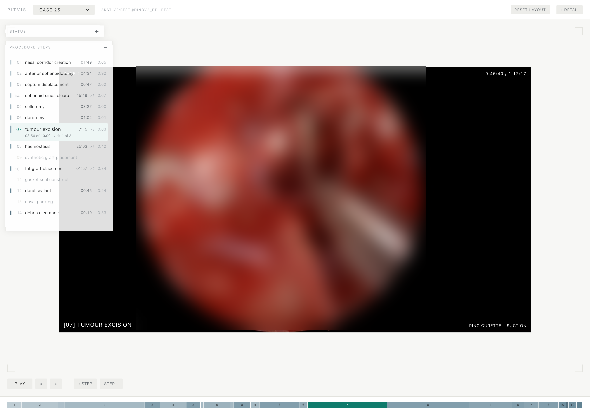
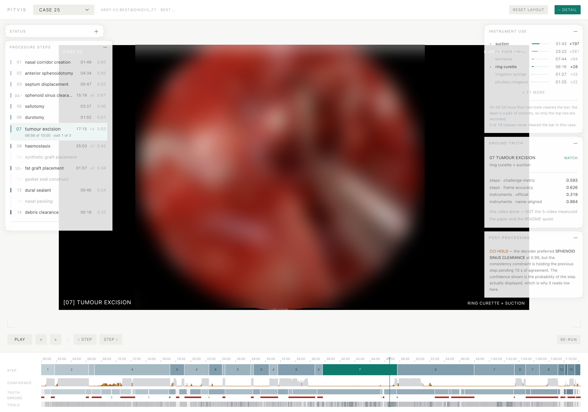

# PitVis Surgical Phase Recognition

Automatic recognition of surgical steps (phases) and instruments in endoscopic
pituitary surgery, reproducing two winning models from the
[PitVis-2023 Challenge](https://doi.org/10.1016/j.media.2025.103716)
(EndoVis / MICCAI), and a review surface for watching them work.



> `uv run pitvis-app` — a case plays while the model names the step it believes
> the operation is in and the instruments it sees. The surgical frame is blurred
> in these images; the dataset is CC BY-NC-ND. See [Licence](#licence).

<details>
<summary><b>With <code>[ + DETAIL ]</code> — the analyst layer</b></summary>



Confidence, the ground-truth timeline, where the two disagree, and the official
scores. Hidden by default: the visible layer answers *what is happening now*,
this one answers *how well is the model doing*.
</details>

### What you can run without the 40 GB download

The dataset, the feature cache and all model output are gitignored, so a fresh
clone gets code and documentation only. Two things still work immediately:

```sh
uv sync && uv run pytest        # 136 tests — metrics, Range parsing, case model
uv run pitvis-models            # ~1 s shape + parameter trace through the cascade
```

Everything else needs the dataset — see [Getting started](#getting-started).

**New here?** [`notes/walkthrough.md`](notes/walkthrough.md) is the guided tour of
the *ideas*: what the surgery is, what every annotation column means, how the data
flows, and which line of which file to read next.
[`notes/surfaces/app.md`](notes/surfaces/app.md) covers the review surface — why HTTP Range is
load-bearing, what pre-CCI confidence means, and why the default view hides most
of what the repo can measure.

**What's next?** [`notes/roadmap.md`](notes/roadmap.md) tracks everything left to build,
phased: data engineering → end-to-end pipelining → models → app.

## The task

The dataset contains 25 full-length videos of endoscopic TransSphenoidal Approach
(eTSA) pituitary surgery — 2,600 to 8,600 seconds each, 40 GB total — with
per-second annotations of the surgical step being performed (14 steps such as
*sellotomy*, *durotomy*, *tumour excision*, plus a background class) and of the
instruments in view. Given a video, the goal is to predict the surgical step at
every second.

This is a temporal segmentation problem with real-world difficulties:

- **Heavy class imbalance** — *tumour excision* covers 23.9% of annotated time,
  *nasal packing* 0.06% (a single video).
- **Long sequences** — hours of video per case, so per-frame recognition benefits
  strongly from temporal modeling.
- **Data quirks** — one video (19) is missing annotations, one video (24) runs at
  25 fps instead of 24, and annotations are one row longer than the extractable
  frames. All of these are verified and handled explicitly (see `CLAUDE.md` for
  the full data notes).

## Approach

Two-stage pipeline, standard for surgical phase recognition:

1. **Frame features** — decode each video at 1 fps and embed every frame with a
   frozen encoder. Extraction is resumable; done once, cached under
   `data/features/<space>/`. Four encoders coexist as separate *feature spaces*
   — ImageNet ResNet-50 (2048-d), DINOv2 ViT-B/14 (768-d), and a fine-tuned
   version of each. `--space` selects.
2. **Classification over the cached features** — for **task 1** (steps) a
   frame-wise linear probe as the floor, then CITI's ARST (the challenge
   winner); for **task 2** (instruments) SANO's joint-winning causal LSTM.
   Both read the same cache, so a training run is minutes rather than hours.

Both published architectures are reproduced first, then iterated on — loss,
decision rule, and encoder, each isolated and cross-validated over the 19
training videos before the 5 validation videos are scored once. The step metric
has gone **0.3425 → 0.5608** across four iterations; the largest single gain
came from fine-tuning the encoder, and only on the second attempt, after the
first destroyed the representation. Results, and what each iteration tested,
live in [`notes/models/`](notes/models/) — start with
[`where-we-are.md`](notes/where-we-are.md).

Train/val split follows the paper: videos 01, 12, 21, 24, 25 for validation, the
rest for training (19 train videos in practice, since video 19 has no labels).
Evaluation is the official challenge metric, not an approximation of it:
`(macro F1 + normalised edit score) / 2`, with the rare classes (background,
*gasket seal construct*, *nasal packing*) excluded from scoring, computed **per
video and mean-averaged** as in the paper. The organisers' scoring code is
vendored verbatim as `src/pitvis/evaluation/official.py` and called directly, so reported
numbers are directly comparable to the paper. Per-class recall/F1 and a
confusion matrix are printed alongside as diagnostics.

## Layout

```
src/pitvis/
  paths.py                  every filesystem location, defined once
  data/
    inventory.py            probe videos + verify annotation invariants
    extract_features.py     1 fps decode -> frozen ResNet-50 features (resumable)
    verify_cache.py         integrity check of the feature cache
    dataset.py              per-video (T, 2048) features + labels, split constants
  models/
    arst.py                 CITI's task-1 architecture (spatial + TeCNO + ARST)
    lstm.py                 SANO's task-2 architecture (causal windowed LSTM)
  training/
    registry.py             the only list of trainable models — add one here
    arst.py                 three-stage training + auto-regressive inference
    baseline.py             frame-wise linear probe baseline
    instruments.py          SANO task-2 (instrument recognition) training
  inference/
    predict.py              mp4 -> steps + instruments; no labels needed
  app/
    run.py                  local review surface — play a case beside the model
    server.py               HTTP mechanics only (Range, SSE, static)
    case.py                 the case document the frontend consumes
    assets/                 index.html + css + ES modules; no build step
  evaluation/
    official.py             organisers' STEP scoring code, vendored — do not edit
    official_instruments.py organisers' INSTRUMENT scoring code, vendored
    metric.py               task-1 metric per video + mean±std, plus diagnostics
    instruments.py          task-2 metric (multi-label, weighted F1)

tests/test_eval.py          pins the task-1 metric to the official code
tests/test_eval_instruments.py  pins the task-2 metric, incl. its upstream defect
tests/test_app_range.py     pins HTTP Range — whether a case plays at all
tests/test_app_case.py      pins the case document and the probability outputs
notes/README.md             the map — which layer each document belongs to
notes/where-we-are.md       dated snapshot: where the numbers got to, what to run next
notes/walkthrough.md        the domain, the data, and the pipeline — start here
notes/embeddings.md         what the feature cache is and how embeddings are made
notes/roadmap.md            phased plan of remaining work
notes/reference/            look-up layer: the data, the metrics, the shape trace
notes/models/               reproductions, and the iterations that beat them
notes/surfaces/             the review app, and serving without Python
data/features/              cached per-video features.npy + labels.npy (gitignored)
data/arst/                  CITI task-1 checkpoints + result.json (gitignored)
data/instruments/           SANO task-2 checkpoint + result.json (gitignored)
26531686/                   raw PitVis download (gitignored, read-only)
```

## Getting started

Run these in order. Steps 1–3 take minutes; step 4 takes hours and is the one to
plan around.

**Already have `data/features/`?** Skip to step 5 — `uv run pitvis-verify`
confirms the cache in about a minute, and steps 5–6 take under five minutes total.

### 0. Prerequisites

Three things the repo cannot install for you:

- **[uv](https://docs.astral.sh/uv/)** — manages Python and every dependency.
  Python 3.13 is pinned via `.python-version`; uv fetches it if you don't have it.
- **`ffmpeg` and `ffprobe`** — hard requirements, and **not** Python packages, so
  uv cannot supply them: `brew install ffmpeg`.
- **The PitVis download**, placed at `26531686/` in the project root — videos,
  `annotations_*.csv` and `map_*.csv` directly inside it. **40 GB.** Gitignored
  and treated as read-only.

### 1. Install

```sh
uv sync
```

Creates `.venv`, installs the locked dependencies, and installs `pitvis` itself as
an editable package. There is no venv to activate — `uv run` handles it.

### 2. Check the install before spending hours on data

Both of these run with **no data at all**, so they separate "is my environment
right?" from "is my data right?" — worth doing before committing to step 4.

```sh
uv run pitvis-models      # ~1 s: every tensor shape and parameter count
uv run pytest             # ~3 s: 136 tests pinning both metrics + the registry
```

`pitvis-models` falls back to a synthetic tensor when the cache is absent, so it
works on a fresh clone.

### 3. Look at the raw data (optional, ~13 s)

```sh
uv run pitvis-inventory
```

Probes all 25 videos, asserts the annotation invariants, and writes
`notes/reference/inventory.md`. Step 4 runs this first anyway — do it separately if you
want to see the dataset before committing to the decode.

### 4. Build the feature cache — the long one

```sh
uv run pitvis-data        # inventory -> extract -> verify
```

| stage | what it does | cost |
|---|---|---|
| `inventory` | probe videos, check annotation invariants | ~13 s |
| **`extract`** | decode 40 GB at 1 fps, embed with a frozen ResNet-50 | **hours** |
| `verify` | re-derive labels from the raw CSVs and diff against the cache | ~1 min |

Order matters: `inventory` asserts the invariants `extract` relies on, so a bad
download fails in 13 seconds rather than after hours of decoding.

**Extraction is resumable** — videos already present at the expected length are
skipped, so interrupting it is safe and re-running continues where it stopped. It
prints per-video progress in frames/sec. End state is a **939 MB** cache.

Preview without committing:

```sh
uv run pitvis-data --dry-run
```

### 5. Train

```sh
uv run pitvis-train       # every registered model: baseline -> arst -> instruments
```

Runs both models against the same 5 validation videos with the same official
metric — which is the point. The linear probe's edit score (~0.01) against ARST's
(~0.35) is the whole argument for the temporal architecture, and it is only
credible when both numbers come from one command on one machine.

ARST alone is ~112 s training plus ~50 s inference:

```sh
uv run pitvis-train arst
uv run pitvis-train --list      # what models are registered
```

### 6. Predict on a video

```sh
uv run pitvis-predict --video 26531686/video_19.mp4
```

Video 19 is the one to try first: it has **no annotations**, so it exercises the
real "point this at a new case" path. ~5 s on a cache hit. Writes
`predictions/video_19/` — `predictions.csv` and `segments.csv` (task 1),
`instruments.csv` (task 2), and `summary.json`. Both tasks run off one feature
pass; `--labels annotations_NN.csv` scores both.

To see it scored against ground truth:

```sh
uv run pitvis-predict --video 26531686/video_25.mp4 \
                      --labels 26531686/annotations_25.csv
```

Any trained model can be named rather than pointed at:

```sh
uv run pitvis-predict --list-models                       # what is trained here
uv run pitvis-predict --video V --steps-model arst        # the reproduction
uv run pitvis-predict --video V --instruments-model instruments-v2:weighted
```

With no `--*-model` flag it uses the best checkpoint trained on this machine —
the leaderboard winner if the iteration has run, the reproduction otherwise.

### 7. Watch a case

```sh
uv run pitvis-app
```

Opens a local page that plays the video and shows, second by second, the step
the model believes the operation is in and the instruments it believes are in
view. `[ + DETAIL ]` adds confidence, the ground-truth timeline, where the two
disagree, and the scores.

Videos with cached features but no predictions can be run from the page itself
(about 45 s); anything uncached prints the command instead rather than starting
a 20-minute decode from a click. `--case video_25` opens a specific case,
`--video path/to/case.mp4` one outside the download.

### Then read, in this order

1. [`notes/walkthrough.md`](notes/walkthrough.md) — the surgery, the data, the pipeline
2. [`notes/reference/data-dictionary.md`](notes/reference/data-dictionary.md) — what every annotation integer means
3. [`notes/embeddings.md`](notes/embeddings.md) — what the feature cache *is*
4. [`notes/models/citi-baseline.md`](notes/models/citi-baseline.md) — why the model is what it is, and results
5. [`notes/reference/citi-dataflow.md`](notes/reference/citi-dataflow.md) — the same model as a shape trace
6. [`CLAUDE.md`](CLAUDE.md) — decisions and constraints; terse, read it when something surprises you

## Usage

Reference for the full command surface — see [Getting started](#getting-started) for
the order to run them in the first time.

Each package under `src/pitvis/` has a `run.py` that runs that directory end to end:

```sh
uv run pitvis-data      # inventory -> extract -> verify  (the whole data pipeline)
uv run pitvis-train     # train every registered model    (~5 min)
uv run pitvis-predict --video case.mp4   # both tasks on any video
uv run pitvis-eval      # score an existing checkpoint, no retraining
uv run pitvis-models    # shape + parameter trace through the cascade (~1 s)
uv run pitvis-app       # play a case beside the model's output, in a browser
```

Four more exist for the paths that need pixels rather than cached features, or
that leave Python entirely:

```sh
uv run pitvis-frames     # decode 1 fps frames to disk — the data path fine-tuning needs
uv run pitvis-finetune   # fine-tune a backbone on those frames (GPU; see infra/)
uv run pitvis-probe      # mean-AP diagnostic: does one feature space beat another
uv run pitvis-export     # the step cascade to ONNX, with per-second verification
```

`pitvis-frames` and `pitvis-finetune` are the only commands that need the raw
video and a GPU respectively — everything else runs off the feature cache. See
[`infra/README.md`](infra/README.md) for running the fine-tune on a rented GPU,
and [`notes/surfaces/deployment.md`](notes/surfaces/deployment.md) for what the ONNX export does
and does not cover.

Every runner takes `--dry-run` to print the plan without executing, and
`--only` / `--skip` to run part of a workflow:

```sh
uv run pitvis-data --dry-run              # what would run, in what order
uv run pitvis-data --only verify --probe  # just the slow integrity check
uv run pitvis-data --videos 1 2 3         # limit extraction to 3 videos
uv run pitvis-train arst --ablations       # one model plus its variants
uv run pitvis-train --list                 # what models are registered
```

Models are named positionally and come from `training/registry.py`, so adding a
model needs no new console script:

```sh
uv run pitvis-train arst              # just ARST
uv run pitvis-train baseline arst     # both, in the order given
uv run pitvis-train arst --no-cci     # unknown flags pass through to the model
```

The individual stages are still addressable when you want one thing:

```sh
uv run pitvis-inventory        # sanity-check the raw data, write notes/inventory.md
uv run pitvis-extract          # one-time feature extraction (all 25 videos)
uv run pitvis-verify           # integrity-check the feature cache
uv run pytest                  # verify the metric against the official code
```

These are console scripts declared in `pyproject.toml`, so each maps to exactly one
module's `main()` — and the runners call those same `main()`s rather than a copy, so
`pitvis-data` and `pitvis-extract` cannot drift apart. Every module is also runnable
directly if you prefer (`uv run python -m pitvis.training.arst --help`).

`uv run` syncs the environment first, so there is no venv to activate. To add or change
a dependency, use `uv add <pkg>` / `uv remove <pkg>` rather than editing `pyproject.toml`
by hand, and commit the updated `uv.lock`.

Torch resolves to the default PyPI wheels, which give CPU + MPS on macOS. For a CUDA
box, add a `[[tool.uv.index]]` entry pointing at the appropriate PyTorch index.

## Licence

This project is licensed **AGPL-3.0-or-later** — see [`LICENSE`](LICENSE).

Two exceptions and one dependency are worth knowing about before you reuse
anything; [`NOTICE`](NOTICE) is the authoritative version.

- **`src/pitvis/evaluation/official.py` and `official_instruments.py` are not
  mine.** They are the challenge organisers' scoring scripts, vendored verbatim
  from [`dreets/pitvis`](https://github.com/dreets/pitvis) with the commit and
  sha256 recorded in each file header. They are here so that the scores this
  project reports are the challenge's scores *by construction* rather than by
  reimplementation — a claim you can check instead of taking on trust. The
  upstream repository publishes no licence, so the AGPL grant does not extend
  to them.
- **No dataset files are in this repository.** `26531686/`, `data/` and
  `predictions/` are gitignored and must be obtained separately.
- **The dataset is CC BY-NC-ND 4.0** — attribution, non-commercial, no
  derivatives. Screenshots in this README have the surgical frame blurred (see
  [`scripts/blur_frame.py`](scripts/blur_frame.py)) so that no adapted copy of
  the video is redistributed here.

If you use the dataset, its authors ask that you cite:

> A. Das et al., "PitVis-2023 Challenge: Workflow Recognition in Videos of
> Endoscopic Pituitary Surgery", *Medical Image Analysis*, 2025.
> [doi:10.1016/j.media.2025.103716](https://doi.org/10.1016/j.media.2025.103716)

**Not a medical device.** This is a research reproduction. Nothing here is
validated for clinical use and it must not inform patient care.
