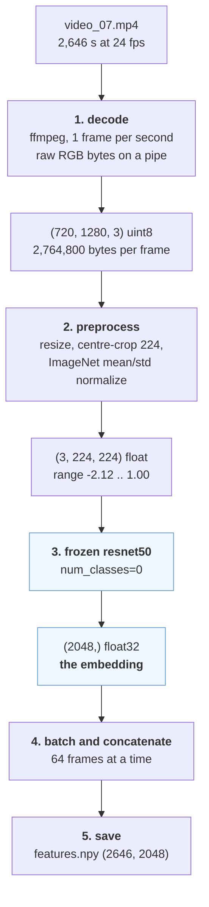

# What the feature cache actually is

A ground-up explanation of `data/features/` — what an embedding is, how ours are
generated, and why the pipeline is shaped this way.

This overlaps `walkthrough.md` §8, which covers the same stage as terse reference
with line numbers. This file is the slower version: it starts from "what is a
feature vector" and every number in it was read off the real cache, not
estimated. If you want the code tour, read §8. If you want to understand what the
thing *is*, read this first.

---

## 1. One video, on disk

```
$ ls data/features/video_07/
features.npy   labels.npy
```

Loading them:

```
features (2646, 2048) float32   |   labels (2646,) int64
```

`video_07` is 2,646 seconds of surgery. So:

- **2,646 rows** — one per second of video.
- **2,048 numbers per row** — the feature vector, a.k.a. the *embedding*, for that
  one second.

"Feature vector" and "embedding" are the same thing here. Both mean: a fixed-length
list of numbers that summarises one video frame.

The labels sit alongside, one integer per second:

```
labels, first 40 s: [0 0 0 0 ... 0]           <- step 0 = background, scope not in patient yet
labels, last 20 s : [12 12 ... 12 0 0 0 0]    <- step 12 = dural sealant, then background
```

And the whole of `video_07` in one line — seconds spent in each step:

```
{0: 203, 1: 79, 2: 360, 3: 51, 4: 393, 5: 385, 6: 217, 7: 138,
 8: 262, 9: 224, 10: 295, 12: 39}
```

**The model's job is: given 2,048 numbers, output which of the 15 steps this
second is.** The baseline does it with a single `Linear(2048, 15)` — literally one
matrix multiply. Everything in Phase 3 of the roadmap is a more sophisticated
answer to that same question.

---

## 2. How an embedding is generated

Five stages, `src/pitvis/data/extract_features.py:138-173`.



### Stage 1 — decode one frame per second

`ffmpeg` with the filter `select=not(mod(n\,r))` keeps frames `0, r, 2r, …` where
`r` is the video's rounded fps. Frames arrive on a pipe as raw RGB with **no
delimiters**, so the read loop takes exactly `1280 * 720 * 3 = 2,764,800` bytes at
a time and treats a short read as end-of-stream (`extract_features.py:156-161`).

`r` is probed **per video**. `video_24` is 25 fps while every other video is 24.
Hard-coding 24 would drift that video's labels by ~4% of its length — and
`video_24` is in the validation set.

Note ffmpeg still *decodes* every frame; the filter only discards them afterwards.
That is why this stage is slow: 2,887,773 frames decoded to yield 120,018 kept, a
24:1 throwaway ratio.

### Stage 2 — preprocess

`(720, 1280, 3)` uint8 → `(3, 224, 224)` float. Three things happen: resize the
short side, centre-crop to 224x224, then subtract the ImageNet mean and divide by
its std. That last step is why the output range is `-2.12 .. 1.00` rather than
`0 .. 1`.

The transform is not hand-written — it comes from timm's
`resolve_data_config` for this backbone, so it matches what the pretrained weights
were trained under:

```
{'input_size': (3, 224, 224), 'crop_pct': 0.95, 'interpolation': 'bicubic'}
```

**Why the crop is right here.** An endoscopic frame is a *centred circle* with
black pillarbox bars either side. Centre-cropping discards the bars and clips only
a thin sliver of the circle. The organisers' own example instead squashes the full
1280x720 to 224x224 — keeping the bars, spending ~37% of its input on nothing, and
distorting the aspect ratio. It also feeds `[0,1]` pixels to ImageNet weights with
no normalisation at all, which is simply a bug. Ours is the better version; do not
"align" to theirs.

### Stage 3 — the frozen ResNet-50

This is the part that turns an image into numbers.

A normal ResNet-50 classifies ImageNet photos into 1,000 categories:

```
224x224x3  ->  [conv stack]  ->  7x7x2048  ->  global avg pool  ->  2048  ->  Linear(2048,1000)  ->  1000 logits
                                                                      ^
                                                          num_classes=0 cuts here
```

The conv stack progressively shrinks the image while growing the channel count.
The final feature map is a **7x7 spatial grid with 2,048 channels**. Global average
pooling then averages each channel across all 49 spatial positions, collapsing
`7x7x2048` down to a flat `2048`.

So **2,048 is not a chosen number.** It is simply how many channels ResNet-50's
last block has. Each of the 2,048 values is roughly "how strongly does some visual
pattern appear *anywhere* in this frame."

`timm.create_model(BACKBONE, pretrained=True, num_classes=0)`
(`extract_features.py:71`) removes the final `Linear`, so we get the 2,048-d pooled
vector instead of 1,000 ImageNet scores.

Two consequences worth carrying forward:

- **The pooling destroys spatial information.** The embedding is averaged over the
  whole image, so nothing in this pipeline localises anything in the frame. This is
  exactly the open problem in roadmap 5.4 (agentic spatial grounding) — the step
  classifier is temporal-only by construction, not by oversight.
- **"Frozen" means these weights are never updated.** The ResNet is a fixed
  image→numbers function. It is ImageNet-pretrained and has never seen an
  endoscope.

### Stages 4 and 5 — batch, assert, save

64 frames per forward pass (`:150-154`), concatenated to `(T, 2048)`. Then:

```python
assert len(features) == expected, ...   # extract_features.py:170
```

If ffmpeg's `select` filter and our `ceil(nb_frames / r)` arithmetic ever disagree,
this fails loudly rather than silently misaligning every label in the video.

---

## 3. Why the numbers look the way they do

```
value range: min 0.000  max 4.057  mean 0.051
one frame vector, dims 0-7: [0.4641  0.  0.  0.0295  0.0089  0.  0.1917  0.2163]
```

Non-negative, with many exact zeros. Both follow from the architecture: the last
operation before pooling is a **ReLU**, which clamps negatives to zero. Any given
frame only triggers a small fraction of the 2,048 detectors, so embeddings are
sparse and low-mean.

That sparsity and the wildly different per-dimension scales are why
`train_baseline.py` standardizes each dimension (subtract mean, divide by std) on
the train split before the linear layer. Feeding raw embeddings to a linear model
would let a few high-variance dimensions dominate the gradient.

> Saving those mean/std values as a real artifact is roadmap item **1.3**, and it
> is a correctness blocker: any inference path must apply the *same* transform, and
> today `train_baseline.py:45` computes them inline and discards them on exit.

---

## 4. Verifying it yourself

The claim "this is how the cache was made" is checkable. This script decodes a
single frame, regenerates its embedding from scratch, and diffs it against the
cached one:

```python
import numpy as np, subprocess, torch, timm
from timm.data import create_transform, resolve_data_config
from PIL import Image

W, H = 1280, 720
cmd = ['ffmpeg', '-v', 'error', '-i', '26531686/video_07.mp4', '-vframes', '1',
       '-f', 'rawvideo', '-pix_fmt', 'rgb24', 'pipe:1']
buf = subprocess.run(cmd, capture_output=True, check=True).stdout
frame = np.frombuffer(buf, np.uint8).reshape(H, W, 3)

model = timm.create_model('resnet50', pretrained=True, num_classes=0).eval()
cfg = resolve_data_config({}, model=model)
x = create_transform(**cfg)(Image.fromarray(frame))

with torch.no_grad():
    emb = model(x.unsqueeze(0)).numpy()[0]

cached = np.load('data/features/video_07/features.npy')[0]
print('max abs difference: %.3e' % np.abs(cached - emb).max())
```

Result when run:

```
cached vector, dims 0-7  : [0.4641 0.     0.     0.0295 0.0089 0.     0.1917 0.2163]
just-computed,  dims 0-7 : [0.4641 0.     0.     0.0295 0.0089 0.     0.1917 0.2163]
max abs difference       : 6.199e-06
```

The 6e-6 residual is float32 rounding — the cache was built on MPS, this ran on
CPU. Not a discrepancy.

---

## 5. The tradeoff the whole repo is built on

| | cost |
|---|---|
| Decode 40 GB of video → 120,018 embeddings | **hours**, paid once |
| Train a model on the cached embeddings | **seconds** |

The cache is 939 MB. Because the expensive stage runs once and its output is
small, every downstream experiment is cheap. That is the entire reason the backbone
is frozen at this stage: it buys a fast experiment loop for the temporal models,
which are the actual point.

The price is that we are stuck with whatever an ImageNet network happens to notice
about tissue and instruments it has never seen. Which is why:

- roadmap **3.6** (fine-tune the backbone end to end) is flagged as the
  highest-expected-gain item, and
- roadmap **1.7** is the decision that gates it — extraction saves embeddings and
  **throws the pixels away**, so there is no data path to fine-tuning today. Either
  frames get written to disk (~4 GB at 256 px, ~25 GB at native 720p) or a
  `Dataset` decodes them on the fly.

The cross-cutting risk in `roadmap.md` states it plainly: everything except 3.6
builds on a backbone that has never seen an endoscope. If temporal modeling
plateaus well below the paper, this is the reason.
