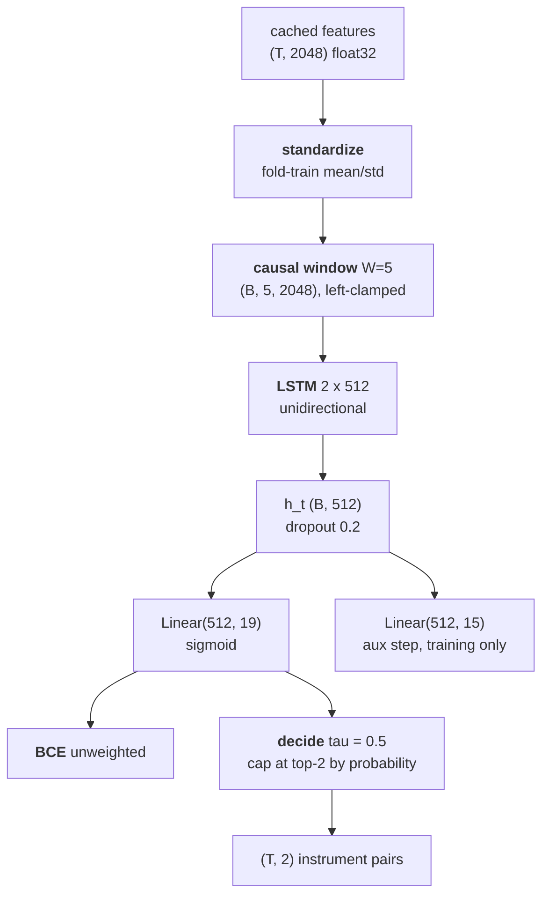
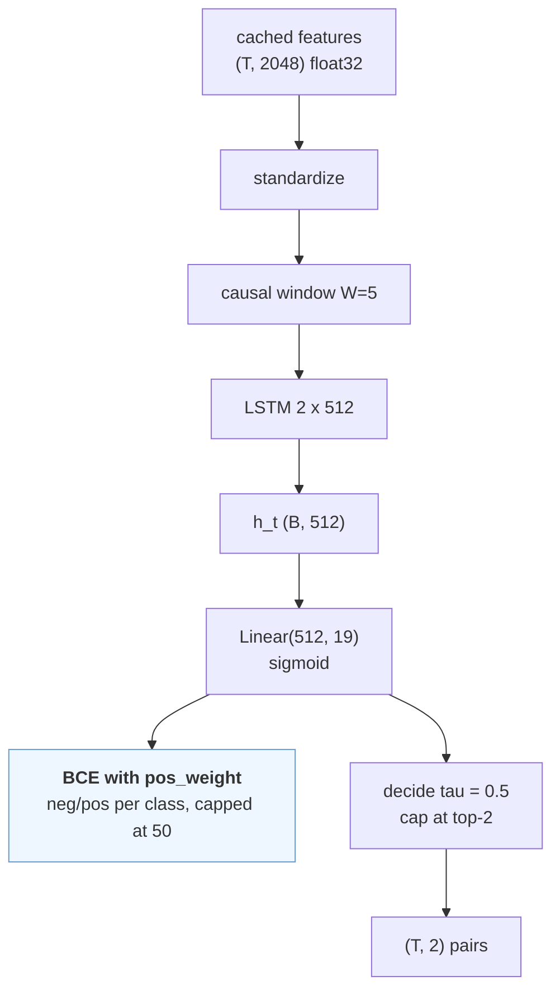
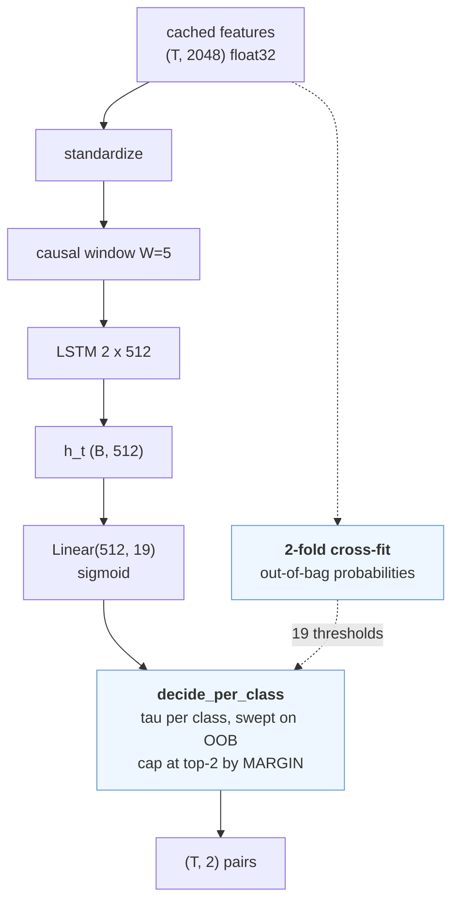
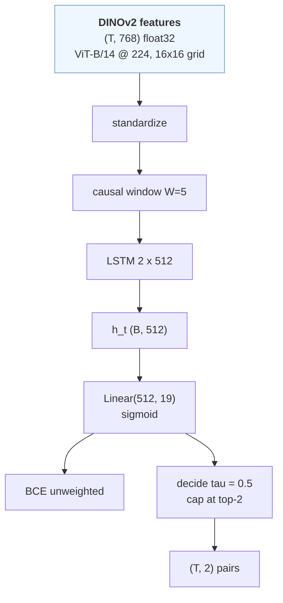

# Instrument variants — the iteration on top of SANO

The companion to [`instruments.md`](instruments.md), which is the SANO
reproduction and stays that. This is what we tried to beat it with, what each
attempt was testing, and which one survived a protocol designed to stop us
fooling ourselves.

Code: `src/pitvis/training/instruments_v2.py`, `src/pitvis/training/crossval.py`,
`src/pitvis/data/folds.py`, `src/pitvis/data/spaces.py`.

---

## 1. What was wrong

SANO reproduces at **0.2321** official / **0.6234** name-aligned weighted /
**0.2556** macro on the five validation videos. Table 8 of Das et al.
benchmarks *those same five videos* at **SANO 81, SDS-HD 89, CITI 88**.

The per-class breakdown says exactly where it goes:

| id | name | support | predicted | F1 |
|---|---|---|---|---|
| 16 | suction | 11,971 | 13,971 | 0.779 |
| 0 | no visible instrument | 9,275 | 9,196 | 0.775 |
| 8 | kerrisons | 3,567 | 2,002 | 0.551 |
| 13 | ring curette | 4,314 | 1,741 | 0.504 |
| 11 | pituitary rongeurs | 909 | 117 | 0.144 |
| 5 | freer elevator | 226 | 54 | 0.229 |
| 1, 4, 6, 7, 12, 14, 17 | seven others | 49–412 | **0** | **0.000** |

**Nine of nineteen classes are never predicted at all**, and the four that work
carry ~91% of positives. Everything collapses toward the prior — the signature
of unweighted BCE under a 360:1 imbalance, decided at a flat 0.5 threshold.

Neither the loss weighting nor the threshold is specified by the paper, and
SANO explicitly *did* balance (upsampling five instrument classes) — a row our
own faithfulness table marks as not reproduced. So the most faithful change
available is also the most promising one.

---

## 2. The protocol, fixed before any variant ran

**Selection is 5-fold cross-validation over the 19 training videos.** Each is
held out exactly once, and the 19 out-of-fold predictions go through a single
`evaluation.instruments.evaluate` call — per-video-then-mean, the challenge's
own convention.

**VAL is scored exactly once, for the winner.** Five videos with a per-video
std around 0.05 cannot rank four variants, and Das et al. measure a **−47
point** val→test collapse for instruments (SDS-HD: 89 → 41.7) against −7 for
steps. Ranking on VAL would rank noise and would quietly turn VAL into a
selection set.

**Primary metric `macro_f1`.** It is what the paper names for task 2 and the
only one of the three that moves when a dead class comes alive.

**Guard on the official `metric`.** A variant only wins if it does not regress
the official number by more than one std of the 19-video spread. The official
metric is weighted and support-dominated, so a variant trading id-16 precision
for id-17 recall could raise macro while lowering the headline.

**Folds are frozen literals** (`data/folds.py`), chosen by seeded search so
every class survives in every fold's training portion, class 17's three videos
land in three different folds, and every fold holds out a class-1 video. Held-out
frame spread across folds is 350 s.

*Known bias, recorded not fixed:* `zero_division=1` scores an absent class 1.0,
so folds without a class-17 video are inflated — exactly as the VAL headline
already is. Frozen folds make it a constant offset across variants, so the
ranking holds; the pooled per-class table is the honest read of competence.

---

## 3. The variants

Each changes exactly one thing. The diagrams differ from the control skeleton
at exactly one node — that *is* the isolation argument.

### control — SANO unchanged

The anchor. Without it every delta is unanchored, because a CV mean over 19
training videos is not comparable to the VAL mean SANO's published number came
from.

### weighted — the loss

*Hypothesis:* the dead classes are a gradient-imbalance artifact. The signal is
there; unweighted BCE drowns it.
*Falsified if:* the seven zero-F1 classes stay at 0.000 and macro moves less
than the fold spread.

`pos_weight` = neg/pos per class, computed on the fold's own training videos,
capped at 50 — uncapped, class 1 lands near 370 and its gradient swamps the
batch, which would make it a divergence experiment rather than a rebalancing
one.

### thresholds — the decision rule

*Hypothesis:* the ranking signal is already in the logits and the flat 0.5 cut
is what discards it.
*Falsified if:* the best achievable per-class tau still yields ≈0 F1 for a dead
class — which would mean the logits carry no signal, a representation failure
rather than a decision-rule one.

Two details matter. Thresholds are swept on **out-of-bag** probabilities via
2-fold cross-fitting inside each fold's training videos: fitting tau where the
model trained biases it upward, which is the opposite of what a rare class
needs, and carving out a holdout instead would shrink the training set and
confound the comparison with control. And the top-2 cap ranks by **margin**
(`prob − tau`) rather than raw probability — once one class clears at 0.15 and
another at 0.60, probabilities are not comparable across classes, the frequent
class wins every tie by construction, and the rare one can never survive the
cap.

### dinov2 — the representation

*Hypothesis:* the frozen ImageNet backbone is the bottleneck. It is the one
deviation both our reproductions share from their published counterparts, and
both sit near 50% of Table 8 (instruments 0.2556 vs 81; steps 34.3 vs 70).
*Falsified if:* macro and the official metric are both within the fold spread
of control — which would also refute the shared explanation for the ARST gap.

Identical model, identical loss, identical decision rule. Only the input
changes: DINOv2 ViT-B/14 at 224 px, 768-d, self-supervised on LVD-142M.
Measured at 160.6 img/s — *faster* than ConvNeXtV2 at the same resolution —
with a 16×16 patch grid against ResNet-50's 7×7.

---

## 4. Results

*(filled in from `data/instruments/cv/*.json` — see §5 for the single VAL scoring)*

---

## 5. What this did not test

- **Backbone fine-tuning.** Extraction discards the pixels (roadmap 1.7), so
  every variant here rides a frozen encoder. This is the largest untested lever
  and the most likely explanation for the remaining gap to Table 8.
- **Generalisation past the training split.** CV ranks on training videos. The
  paper's −47-point val→test collapse means even a clean CV win may not survive
  to unseen cases.
- **Ensembles**, which is how SDS-HD reached rank 1 — and whose fusion rule the
  paper never states.
- **Longer temporal context.** A causal TCN variant was scoped and dropped: it
  is the heaviest to build, and batch-of-one-video would change the optimiser
  regime enough that the comparison risks measuring compute rather than
  context.
