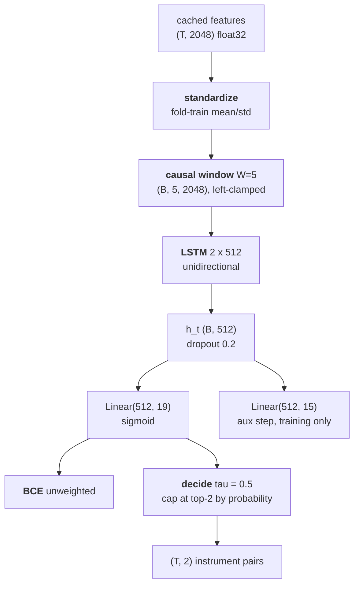
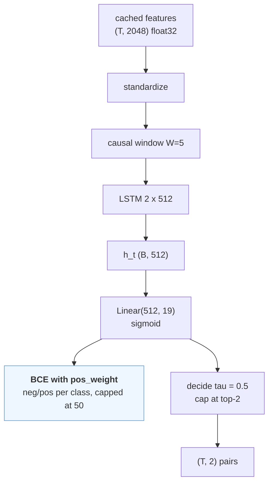
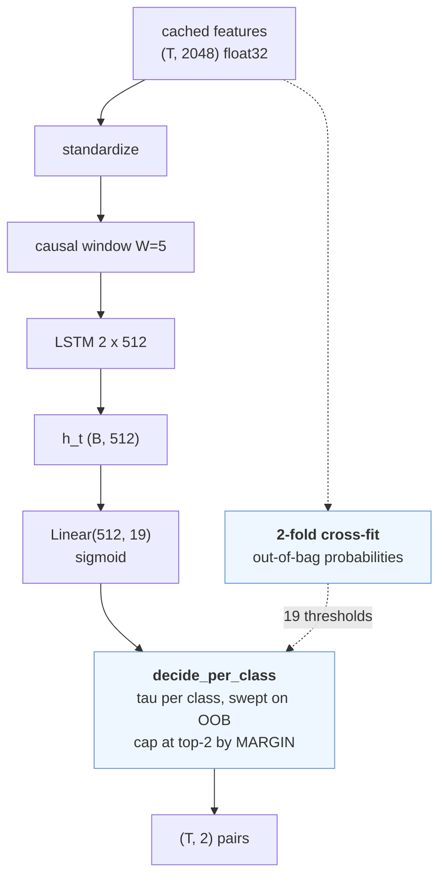
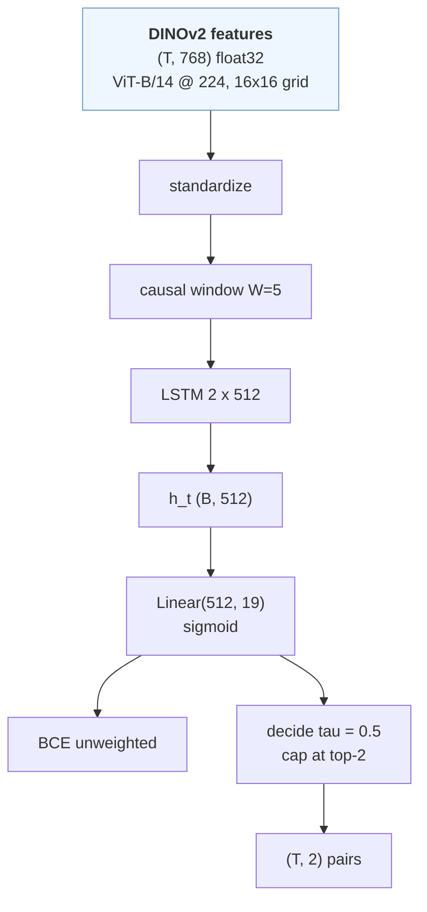

# Instrument variants — the iteration on top of SANO

The companion to [`instruments.md`](instruments.md), which is the SANO
reproduction and stays that. This is what we tried to beat it with, what each
attempt was testing, and which one survived a protocol designed to stop us
fooling ourselves.

Code: `src/pitvis/training/instruments_v2.py`, `src/pitvis/training/crossval.py`,
`src/pitvis/data/folds.py`, `src/pitvis/data/spaces.py`.

---

## 1. What was wrong

SANO reproduces at **0.2321** official / **0.6234** name-aligned weighted /
**0.2556** macro on the five validation videos. Table 8 of Das et al.
benchmarks *those same five videos* at **SANO 81, SDS-HD 89, CITI 88**.

The per-class breakdown says exactly where it goes:

| id | name | support | predicted | F1 |
|---|---|---|---|---|
| 16 | suction | 11,971 | 13,971 | 0.779 |
| 0 | no visible instrument | 9,275 | 9,196 | 0.775 |
| 8 | kerrisons | 3,567 | 2,002 | 0.551 |
| 13 | ring curette | 4,314 | 1,741 | 0.504 |
| 11 | pituitary rongeurs | 909 | 117 | 0.144 |
| 5 | freer elevator | 226 | 54 | 0.229 |
| 1, 4, 6, 7, 12, 14, 17 | seven others | 49–412 | **0** | **0.000** |

**Nine of nineteen classes are never predicted at all**, and the four that work
carry ~91% of positives. Everything collapses toward the prior — the signature
of unweighted BCE under a 360:1 imbalance, decided at a flat 0.5 threshold.

Neither the loss weighting nor the threshold is specified by the paper, and
SANO explicitly *did* balance (upsampling five instrument classes) — a row our
own faithfulness table marks as not reproduced. So the most faithful change
available is also the most promising one.

---

## 2. The protocol, fixed before any variant ran

**Selection is 5-fold cross-validation over the 19 training videos.** Each is
held out exactly once, and the 19 out-of-fold predictions go through a single
`evaluation.instruments.evaluate` call — per-video-then-mean, the challenge's
own convention.

**VAL is scored exactly once, for the winner.** Five videos with a per-video
std around 0.05 cannot rank four variants, and Das et al. measure a **−47
point** val→test collapse for instruments (SDS-HD: 89 → 41.7) against −7 for
steps. Ranking on VAL would rank noise and would quietly turn VAL into a
selection set.

**Primary metric `macro_f1`.** It is what the paper names for task 2 and the
only one of the three that moves when a dead class comes alive.

**Guard on the official `metric`.** A variant only wins if it does not regress
the official number by more than one std of the 19-video spread. The official
metric is weighted and support-dominated, so a variant trading id-16 precision
for id-17 recall could raise macro while lowering the headline.

**Folds are frozen literals** (`data/folds.py`), chosen by seeded search so
every class survives in every fold's training portion, class 17's three videos
land in three different folds, and every fold holds out a class-1 video. Held-out
frame spread across folds is 350 s.

*Known bias, recorded not fixed:* `zero_division=1` scores an absent class 1.0,
so folds without a class-17 video are inflated — exactly as the VAL headline
already is. Frozen folds make it a constant offset across variants, so the
ranking holds; the pooled per-class table is the honest read of competence.

---

## 3. The variants

Each changes exactly one thing. The diagrams differ from the control skeleton
at exactly one node — that *is* the isolation argument.

### control — SANO unchanged

The anchor. Without it every delta is unanchored, because a CV mean over 19
training videos is not comparable to the VAL mean SANO's published number came
from.

### weighted — the loss

*Hypothesis:* the dead classes are a gradient-imbalance artifact. The signal is
there; unweighted BCE drowns it.
*Falsified if:* the seven zero-F1 classes stay at 0.000 and macro moves less
than the fold spread.

`pos_weight` = neg/pos per class, computed on the fold's own training videos,
capped at 50 — uncapped, class 1 lands near 370 and its gradient swamps the
batch, which would make it a divergence experiment rather than a rebalancing
one.

### thresholds — the decision rule

*Hypothesis:* the ranking signal is already in the logits and the flat 0.5 cut
is what discards it.
*Falsified if:* the best achievable per-class tau still yields ≈0 F1 for a dead
class — which would mean the logits carry no signal, a representation failure
rather than a decision-rule one.

Two details matter. Thresholds are swept on **out-of-bag** probabilities via
2-fold cross-fitting inside each fold's training videos: fitting tau where the
model trained biases it upward, which is the opposite of what a rare class
needs, and carving out a holdout instead would shrink the training set and
confound the comparison with control. And the top-2 cap ranks by **margin**
(`prob − tau`) rather than raw probability — once one class clears at 0.15 and
another at 0.60, probabilities are not comparable across classes, the frequent
class wins every tie by construction, and the rare one can never survive the
cap.

### dinov2 — the representation

*Hypothesis:* the frozen ImageNet backbone is the bottleneck. It is the one
deviation both our reproductions share from their published counterparts, and
both sit near 50% of Table 8 (instruments 0.2556 vs 81; steps 34.3 vs 70).
*Falsified if:* macro and the official metric are both within the fold spread
of control — which would also refute the shared explanation for the ARST gap.

*Outcome: falsified in isolation, vindicated in composition.* Alone it gains
+0.021 macro, inside the ±0.048 fold spread. Composed with the training fixes
it is the best variant on all three metrics. See §4.

Identical model, identical loss, identical decision rule. Only the input
changes: DINOv2 ViT-B/14 at 224 px, 768-d, self-supervised on LVD-142M.
Measured at 160.6 img/s — *faster* than ConvNeXtV2 at the same resolution —
with a 16×16 patch grid against ResNet-50's 7×7.

---

## 4. Results

### The leaderboard — 19 out-of-fold training videos

| variant | space | macro_f1 | official metric | aligned-w | dead | never predicted |
|---|---|---|---|---|---|---|
| **best @ dinov2** | dinov2_vitb14 | **0.4554**±0.048 | **0.5281**±0.217 | **0.7404**±0.040 | **0** | **0** |
| weighted | resnet50 | 0.4009±0.073 | 0.2986±0.137 | 0.6419±0.066 | 1 | 0 |
| best | resnet50 | 0.4001±0.069 | 0.4507±0.185 | 0.6608±0.048 | 0 | 0 |
| thresholds | resnet50 | 0.3836±0.068 | 0.3075±0.114 | 0.6624±0.052 | 2 | 1 |
| dinov2 | dinov2_vitb14 | 0.3176±0.048 | 0.2783±0.058 | 0.6724±0.044 | 7 | 6 |
| control (SANO) | resnet50 | 0.2963±0.055 | 0.2401±0.054 | 0.5982±0.069 | 7 | 7 |

Every variant passed the guard — none traded the official metric for macro.
That was not guaranteed and is worth noting: rebalancing *could* have bought
rare-class recall with dominant-class precision, and it did not.

### The result that would have been missed

**DINOv2 alone is worth +0.021 macro — inside the fold spread of ±0.048.**
Taken by itself, that reads as "the backbone is not the problem", and it would
have retired the whole frozen-backbone hypothesis.

But the same backbone *composed with the training fixes* scores 0.4554 against
0.4001 for the identical configuration on ResNet-50 — **+0.055, and the best
result on every one of the three metrics**.

The representation gain was **masked by the imbalance defect**. While 7 of 19
classes are never emitted at all, a better encoder has nothing to express: the
loss discards the signal before the features get a chance to matter. Fix the
loss and the encoder starts paying. Had we run the variants one at a time and
stopped at the first disappointing result — which is exactly what the cheapest
plan would have done — we would have drawn the opposite conclusion.

It also runs *faster*: 86 s against control's 163 s, because 768 informative
dimensions beat 2048 of which 342 are dead on this data.

### Where the macro gain comes from (control -> weighted, out of fold)

| id | name | support | ctrl pred | ctrl F1 | wtd pred | wtd F1 |
|---|---|---|---|---|---|---|
| 6 | haemostatic foam | 343 | **0** | 0.000 | 269 | **0.402** |
| 18 | tissue glue | 282 | 37 | 0.207 | 310 | **0.551** |
| 9 | micro doppler | 679 | 137 | 0.311 | 476 | **0.608** |
| 2 | cottle | 662 | 16 | 0.047 | 184 | 0.239 |
| 13 | ring curette | 7,753 | 2,198 | 0.396 | 3,686 | 0.540 |
| 1 | bipolar forceps | 184 | 0 | 0.000 | **1** | 0.000 |
| 17 | surgical drill | 404 | 0 | 0.000 | **7** | 0.024 |

**"0 never predicted" flatters, and should be read with the column beside it.**
Four classes (1, 4, 12, 17) are emitted so rarely — 1, 25, 19 and 7 times
against supports of 184-492 — that their F1 is still ~0. They cleared the bar
of being *emitted* without becoming *usable*. The genuine recoveries are the
first three rows.

### The single VAL scoring

Run once, after the leaderboard was frozen: `best` on `dinov2_vitb14`.

| | SANO (control) | winner | delta |
|---|---|---|---|
| official `metric` | 0.2321 | **0.5572**±0.225 | **+0.325** |
| aligned weighted | 0.6234 | **0.7383**±0.041 | +0.115 |
| macro F1 | 0.2556 | **0.3792**±0.044 | +0.124 |
| classes never predicted | 9 / 19 | **0 / 19** | — |

For scale, Table 8 benchmarks SANO at **81** on these same five videos. If that
figure is the weighted reading, our 73.8 is ~91% of it; if it is macro, 37.9
against 81 is a much larger remaining gap. The paper labels the column macro
and its shipped code computes weighted, and nothing in either source settles
which produced the published number — so both readings stay on the table.

**The official metric's variance is the thing to distrust.** ±0.225 across five
videos, with video 24 scoring 0.2044 official against 0.8037 name-aligned. That
is the vendored column-ordering defect biting hard — it fired on 3 of 5 videos.
The aligned reading (±0.041) is five times more stable and is the better guide
to whether the model actually improved.

---

## 5. What this did not test

- **Backbone fine-tuning.** Extraction discards the pixels (roadmap 1.7), so
  every variant here rides a frozen encoder. This is the largest untested lever
  and the most likely explanation for the remaining gap to Table 8 — see §6,
  which is the measurement that says so.
- **Generalisation past the training split.** CV ranks on training videos. The
  paper's −47-point val→test collapse means even a clean CV win may not survive
  to unseen cases.
- **Ensembles**, which is how SDS-HD reached rank 1 — and whose fusion rule the
  paper never states.
- **Longer temporal context.** A causal TCN variant was scoped and dropped: it
  is the heaviest to build, and batch-of-one-video would change the optimiser
  regime enough that the comparison risks measuring compute rather than
  context.

---

## 6. The probe that says the encoder is next

Six classes were never predicted at all, and the headline metric cannot say
why — it only ever reports *decisions*, so "the features do not carry this
class" and "the decision rule throws it away" look identical.

**Average precision can separate them.** It is computed from the ranking, so it
is independent of both the threshold and the class's base rate. AP near the base
rate means no signal; far above means signal that something downstream is
discarding. `uv run pitvis-probe` fits a balanced one-vs-rest logistic
regression per class on frozen features, on TRAIN, and scores VAL.

| class | train positives | AP on frozen DINOv2 |
|---|---|---|
| tissue glue | 282 | **0.767** |
| micro doppler | 679 | 0.731 |
| cup forceps | 1,635 | **0.055** |
| retractable knife | 492 | 0.015 |
| bipolar forceps | 184 | 0.026 |

**Rarity does not predict difficulty.** Tissue glue is rarer than four of the
weak classes and is nearly separable. What predicts it is whether the encoder
can see the instrument, and for six of nineteen it cannot. No threshold, class
weight or sampler recovers information that is not in the features — which is
what moves the next lever from the decision rule (§3) to the encoder itself.

A 5-epoch fine-tune of ResNet-50 on the frame cache moved **mean AP 0.271 →
0.445, with 19 of 19 classes improving** (largest: cottle +0.385, haemostatic
foam +0.383, stealth pointer +0.364, surgical drill +0.301). That number is
clean — the probe fits on TRAIN and scores VAL, which no TRAIN-fitted encoder
has seen.

### Fine-tuning DINOv2 made the representation WORSE

The obvious next step — fine-tune the encoder that already wins frozen — ran
for 50 epochs on an L4 and is the clearest negative result in the project.
Same probe, same protocol, frozen against fine-tuned:

| | frozen DINOv2 | fine-tuned DINOv2 | fine-tuned ResNet-50 |
|---|---|---|---|
| mean AP | **0.350** | 0.270 | 0.445 |
| classes improved | — | **3 / 19** | 19 / 19 |

The collapse is broad rather than concentrated: ring curette 0.760 → 0.430,
micro doppler 0.663 → 0.353, spatula dissector 0.116 → 0.013, kerrisons
0.655 → 0.517. Even *suction*, the most common instrument in the dataset, fell
0.903 → 0.751. Exactly one class gained meaningfully (haemostatic foam +0.180).

**The direction is the finding.** Fine-tuning a WEAK encoder (ImageNet
ResNet-50) moved 19/19 classes up. Fine-tuning a STRONG one (DINOv2,
self-supervised on 142M images) moved 16/19 down. DINOv2's pretrained
representation was already better than anything 84,666 frames from 19 videos
can teach, and 50 epochs of supervised pressure at a uniform lr=1e-4 overwrote
it. This is catastrophic forgetting, not a bug.

The training log shows it happening: step accuracy climbed 0.807 → 0.922 by
epoch 12 and kept going. The encoder was not learning to see surgery better,
it was learning to reproduce this training set — and the features separating a
ring curette from a cup forceps are not the features that minimise a 15-way
step loss on videos it has memorised.

**What it cost end to end**, VAL scored once each:

| | steps metric | instruments official | instruments macro |
|---|---|---|---|
| frozen DINOv2 | **0.4610** | **0.5572** | 0.3792 |
| fine-tuned DINOv2 | 0.3500 | 0.2803 | 0.2930 |

Unlike the ResNet-50 case, no metric disagrees: macro falls too, so there is no
reading under which this encoder is better.

#### Why it failed — reasoning, ranked by how much evidence there is

None of these is proven. They are ordered by how much the run itself supports
them, and each names what would settle it.

**1. The learning rate was wrong for this encoder, and there was no warmup.**
*Strongest.* 1e-4 uniformly across a ViT-B is a head-training rate, not an
adaptation rate. Adapting DINOv2 is normally done at ~1e-5 with layer-wise
decay — early blocks moved far less than late ones — and with warmup, because
ViTs are unusually sensitive to large updates in the first few hundred steps.
We had none of that: constant 1e-4 into cosine decay, every block treated
alike, from step one. ResNet-50 tolerated the same recipe, which fits — CNN
features are less fragile and ImageNet features are less worth preserving.
*Test:* 1e-5 with layer-wise decay and 500 warmup steps, 5 epochs, re-probe.

**2. The supervised signal is far weaker than 84,666 frames suggests.**
*Strong, and measured.* Steps are long: across the 19 TRAIN videos there are
**1,229 step segments for 84,685 frames — 69 frames per segment.** Frames
inside a segment share a label and look alike, so the effective number of
independent step decisions is closer to 1,229 than to 84,685. That is a tiny
supervised set for 86M parameters, and it explains the trajectory: step
accuracy 0.807 → 0.922 by epoch 12 is what memorising ~1,200 segments looks
like. The instrument head is denser, but it rides the same encoder.
*Test:* subsample to one frame per segment and compare — if the collapse is
unchanged, redundancy was not the mechanism.

**3. Nothing could stop it.** *Certain, but a contributing cause rather than
the cause.* There is no validation in the fine-tune at all — `val_ds` is
constructed and never used — so 50 epochs ran to completion with no signal that
epoch 5 might have been better. The ResNet pilot that worked was 5 epochs. We
cannot say where DINOv2 peaked because nothing was watching.
*Test:* carve a validation split from TRAIN videos and log AP per epoch.

**4. Training and inference see different crops.** *Plausible, secondary.*
Training augments with `RandomResizedCrop(224, scale=(0.7, 1.0))` from the
384px cache — 70–100% area crops. Extraction uses `crop_pct=1.0`, i.e. the
**whole** frame resized to 224. So the encoder is adapted to zoomed views and
then asked to embed full ones. The endoscopic circle makes this worse than
usual: a 70% crop can clip the circle, producing framings that never occur at
inference. ResNet-50 had the identical mismatch and still improved, which is
why this is fourth rather than first.
*Test:* `scale=(0.9, 1.0)`, or match extraction's view exactly.

**5. The run was not precision-homogeneous.** *A confound, probably not a
cause.* bf16 autocast was added at epoch 5 to make the job affordable, so
epochs 1–4 ran fp32 and 5–50 bf16. bf16 keeps fp32's exponent range and is
standard for ViT training, so it is unlikely to explain a 0.08 AP drop — but
it does mean this was not a clean single-configuration experiment, and it
should be stated rather than quietly ignored.
*Test:* it comes free — any re-run will be bf16 throughout.

**What I do NOT think happened.** Not a data bug: the cache verifies, 120,018
frames, and the AppleDouble contamination was caught before training. Not a
label misalignment: the same annotations feed the frozen-feature runs that
score 0.4610. Not a downstream problem: the probe is a fresh logistic
regression on the features themselves, so it sees the representation directly.

**Three things would have to change to test the idea properly**, and none is
optional on its own:

- **A much lower backbone learning rate.** 1e-4 across a ViT-B is normal for
  training a head and aggressive for adapting a strong encoder; 1e-5 with
  layer-wise decay is the usual prescription.
- **Early stopping on a split carved out of TRAIN.** There is no validation in
  the fine-tune at all (`val_ds` is built and never used), so nothing could
  have stopped near epoch 5 where the ResNet pilot peaked. Using VAL for this
  would be selection on VAL and is not available.
- **Fewer epochs.** The pilot that worked was 5, not 50.

Frozen DINOv2 remains the best encoder in the repo. `dinov2_ft` is kept as the
record of a hypothesis that was tested and failed.

### The recipe, iterated — what changed and why

The failure above was diagnosed as recipe rather than concept, so the recipe
changed. Recorded here because "we fine-tuned it again and it worked" is not a
result unless what differed is written down.

| | run 1 (failed) | run 2 |
|---|---|---|
| backbone LR | 1e-4, uniform | **1e-5**, `lr/10` |
| layer-wise decay | none | **0.75** — 1.0e-05 at the deepest ViT block down to 3.2e-07 at the stem |
| head LR | 1e-4 | 1e-4 (unchanged — the heads are random, they should move) |
| warmup | none | **200 steps**, per batch |
| validation | none | **3 TRAIN videos**, held out by video |
| stopping | fixed 50 epochs | **early stop**, patience 3, `best.pt` kept |
| precision | fp32 → bf16 mid-run | bf16 throughout |

**The reasoning behind each, in the order they matter.**

*Layer-wise decay is the load-bearing one.* A single rate treats the patch
embedding — which encodes generic visual structure, the part of DINOv2 worth
keeping — exactly like the last block, which is the part that should
specialise. Decaying by 0.75 per layer means the stem moves ~30x slower than
the deepest block. This is the standard prescription for adapting a strong
self-supervised encoder, and its absence is the most likely single cause of
the collapse.

*Warmup, per batch not per epoch.* ViTs are unusually sensitive to large
updates in the first few hundred steps. Run 1 went straight to full rate from
step one, on a model with the most to lose from that.

*The validation split is carved from TRAIN, by video.* Not from VAL — stopping
on VAL is selection on VAL and would contaminate the single VAL scoring the
whole protocol rests on. By video rather than by frame because frames run ~69
to a step segment and look alike; a frame-level split puts near-duplicates on
both sides and reports a loss that only measures memory. The cost is real: the
encoder now trains on 16 videos instead of 19.

*Early stopping is what makes the rest testable.* Run 1 could not have stopped
at epoch 5 where the ResNet pilot peaked, because nothing was watching. The
loop now prints a train−val accuracy gap each epoch; on a smoke run it went
+0.010 → +0.411 in a single epoch while held-out accuracy fell, which is
precisely the divergence that ran unnoticed for fifty.

**What did NOT change, deliberately.** The augmentation, the two-head
multi-task setup, the class weighting and the frame cache are all identical.
Changing them at the same time would make the comparison uninterpretable — the
question is whether the *optimisation recipe* was the problem, and that needs
everything else held.

**The falsifier, fixed in advance.** The AP probe is the verdict, not the
downstream metric. If mean AP does not exceed frozen DINOv2's **0.350**, the
recipe was not the problem and fine-tuning this encoder on this dataset should
be abandoned rather than tuned further. Run 1 scored 0.270.

### End to end, the AP gain does not carry to the headline

The `best` recipe on `resnet50_ft` instead of frozen DINOv2, VAL scored once
each (`data/instruments/v2/best@resnet50_ft/`):

| | frozen DINOv2 | fine-tuned ResNet-50 | Δ |
|---|---|---|---|
| official (weighted, w/ defect) | **0.5572** ±0.225 | 0.3805 ±0.232 | −0.177 |
| aligned-weighted | 0.7383 | **0.7973** | +0.059 |
| **macro F1** (primary) | 0.3792 | **0.4783** | **+0.099** |

**The two metrics disagree, and that is the finding.** Macro rises by twice the
fold spread while the official number falls. That is the support-domination the
protocol's guard was written for, seen from the other side: the fine-tuned
encoder is better on the rare classes the macro average weights equally, and
worse on the four that carry ~91% of positives and therefore the weighted score.

**This is not a ranking, and must not be treated as one.** Both arms are single
VAL measurements on five videos, which is exactly what §2 forbids — a CV over
`resnet50_ft` is unavailable because one encoder trained on all of TRAIN leaks
into every fold. Note also that the official column's std (±0.23) is larger than
the gap; video_25 alone scores 0.836 against 0.20–0.32 for the others.

So it is a reason to fine-tune DINOv2 and cross-validate properly, not a reason
to switch. See [`infra/README.md`](../../infra/README.md) for why an honest version
costs six fine-tunes rather than one.
