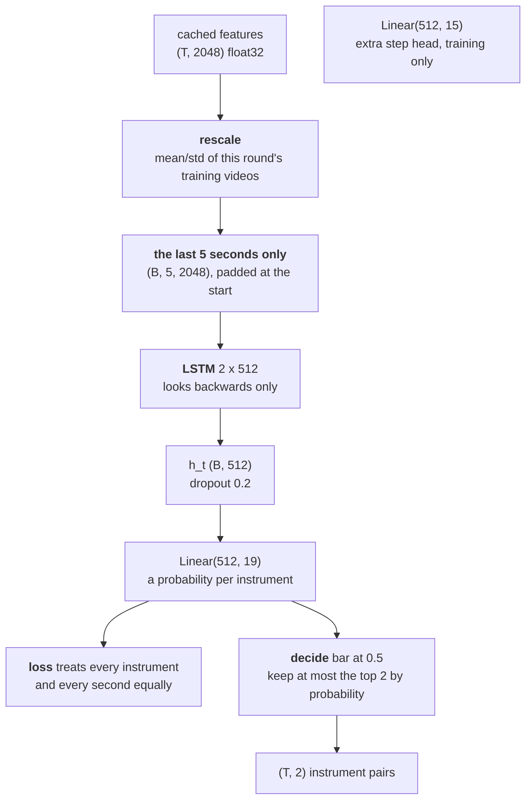
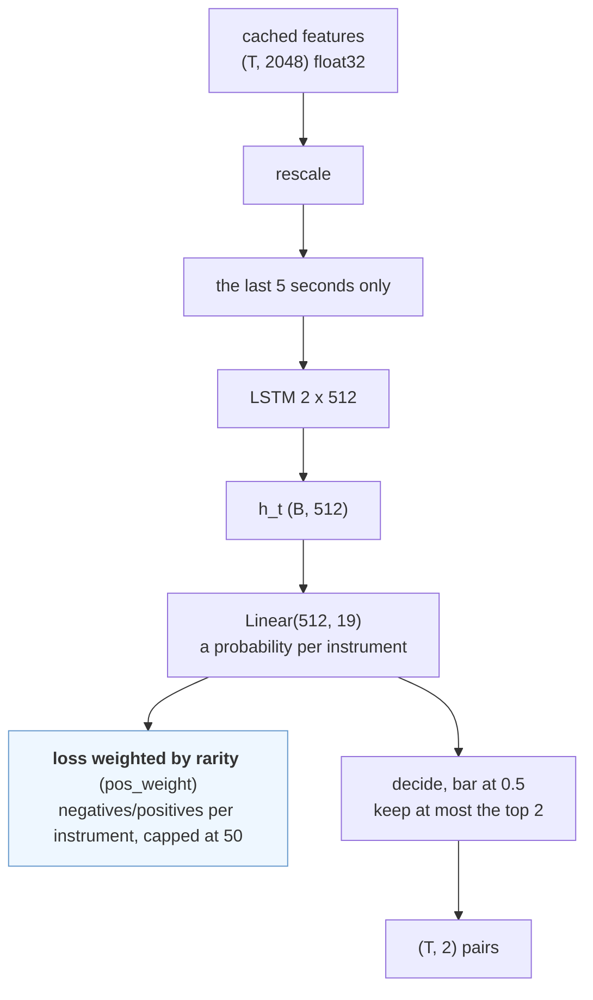
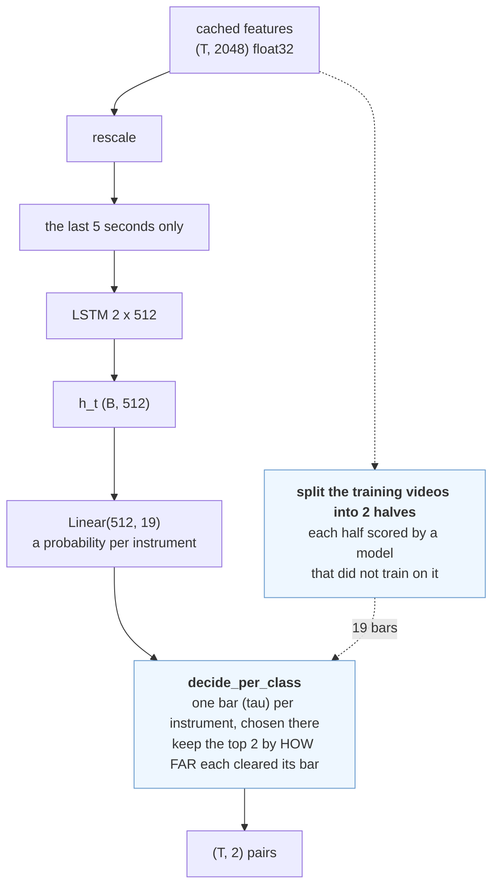
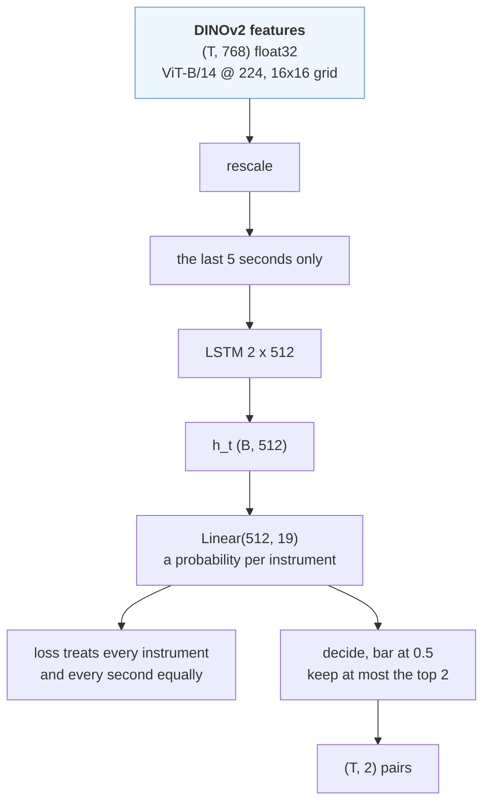

# Instrument variants — what we tried to beat SANO with

The companion to [`instruments.md`](instruments.md), which is the SANO
reproduction and stays that. This is what we tried to beat it with, what each
attempt was testing, and which one survived a way of comparing them designed to
stop us fooling ourselves.

Code: `src/pitvis/training/instruments_v2.py`, `src/pitvis/training/crossval.py`,
`src/pitvis/data/folds.py`, `src/pitvis/data/spaces.py`.

Three names used throughout. **Macro F1** scores each instrument separately and
then averages, so an instrument seen in a few hundred seconds counts as much as
one seen in twelve thousand. The **official weighted score** averages the same
per-instrument scores but in proportion to how often each instrument appears,
so the four common ones decide almost all of it; it is the number the
challenge's own script computes, and that script has a defect described
below. The **name-aligned score** is the same weighted average computed with
that defect repaired. What each measures and why the challenge chose them is in
[`../reference/metrics.md`](../reference/metrics.md).

---

## 1. What was wrong

SANO reproduces at **0.2336** official / **0.6309** name-aligned weighted /
**0.2513** macro on the five validation videos. Table 8 of Das et al.
benchmarks *those same five videos* at **SANO 81, SDS-HD 89, CITI 88**.

The breakdown by instrument says exactly where it goes:

| id | name | positives | predicted | F1 |
|---|---|---|---|---|
| 16 | suction | 11,971 | 13,971 | 0.779 |
| 0 | no visible instrument | 9,275 | 9,196 | 0.775 |
| 8 | kerrisons | 3,567 | 2,002 | 0.551 |
| 13 | ring curette | 4,314 | 1,741 | 0.504 |
| 11 | pituitary rongeurs | 909 | 117 | 0.144 |
| 5 | freer elevator | 226 | 54 | 0.229 |
| 1, 4, 6, 7, 12, 14, 17 | seven others | 49–412 | **0** | **0.000** |

**Nine of nineteen instruments are never predicted at all on VAL**, and the
four that work carry ~91% of positives. (Every count in this section is on the
five validation videos, per the scores above. Scored on the videos held out of
its own training, the same variant reads seven — §4's table — because it is a
different split, not a different finding. Name the split whenever you quote one
of these.) The model predicts whatever is most common and gives up on the rest,
which is what a loss that treats every instrument and every second equally does
under a 360:1 imbalance, with every yes/no decision made at the same flat bar
of 0.5.

Neither the weighting of the loss nor where the bar sits is specified by the
paper, and SANO explicitly *did* balance the classes (showing five instruments'
frames more often) — a row our own faithfulness table marks as not reproduced.
So the most faithful change available is also the most promising one.

---

## 2. How the variants were compared, decided before any of them ran

**The variants are ranked by 5 rounds of training over the 19 training
videos**, each round holding out a different group. Each video is held out
exactly once, and the predictions made on the 19 held-out videos go through one
`evaluation.instruments.evaluate` call — each video scored on its own and the
scores then averaged, never pooled, which is the challenge's own convention.

**The five validation videos were scored exactly once, for the winner.** Five
videos with a per-video spread around 0.05 cannot rank four variants, and Das
et al. measure a **−47 point** drop from validation to test for instruments
(SDS-HD: 89 → 41.7) against −7 for steps. Ranking on the validation videos
would rank noise and would quietly turn them into a selection set.

**`macro_f1` decides the ranking.** It is what the paper names for task 2 and
the only one of the three numbers that moves when an instrument the model never
predicted starts being predicted.

**The official `metric` acts as a guard.** A variant only wins if it does not
get worse on the official number by more than one standard deviation of the
19-video spread. That number is weighted and decided by the common instruments,
so a variant trading id-16 precision for id-17 recall could lift macro while
lowering the headline.

**The groups of videos are frozen literals** (`data/folds.py`), chosen by a
seeded search so that every instrument survives in every round's training
portion, class 17's three videos land in three different rounds, and every
round holds out a class-1 video. The number of held-out seconds varies across
rounds by 350 s.

*Known bias, recorded not fixed:* `zero_division=1` scores an absent class 1.0,
so rounds with no class-17 video are inflated — exactly as the validation
headline already is. Freezing the groups makes it a constant offset across
variants, so the ranking holds; the per-class table pooled across videos is the
honest read of competence.

---

## 3. The variants

Each changes exactly one thing. The diagrams differ from the control skeleton
at exactly one node — that *is* the argument that each change is measured on
its own.

### control — SANO unchanged

The anchor. Without it every difference is unanchored, because a mean over the
19 held-out training videos is not comparable to the validation mean SANO's
published number came from.

```mermaid
flowchart TD
    F["cached features<br/>(T, 2048) float32"]
    STD["<b>rescale</b><br/>mean/std of this round's training videos"]
    W["<b>the last 5 seconds only</b><br/>(B, 5, 2048), padded at the start"]
    L["<b>LSTM</b> 2 x 512<br/>looks backwards only"]
    H["h_t (B, 512)<br/>dropout 0.2"]
    I["Linear(512, 19)<br/>a probability per instrument"]
    S["Linear(512, 15)<br/>extra step head, training only"]
    LOSS["<b>loss</b> treats every instrument<br/>and every second equally"]
    D["<b>decide</b> bar at 0.5<br/>keep at most the top 2 by probability"]
    P["(T, 2) instrument pairs"]
    F --> STD --> W --> L --> H
    H --> I --> LOSS
    I --> D --> P
```

### weighted — changing the loss

*What this was testing:* that the instruments never predicted are an artifact
of the loss, not of the features. The signal is there; a loss that counts every
second equally drowns it.
*What would have shown it wrong:* the seven instruments with 0.000 F1 stay
there and macro moves less than the spread between rounds.

`pos_weight` = negatives/positives per instrument, computed on that round's own
training videos, capped at 50 — uncapped, class 1 lands near 370 and swamps
everything else in the batch, which would make it an experiment in whether
training falls apart rather than one in rebalancing.

```mermaid
flowchart TD
    F["cached features<br/>(T, 2048) float32"]
    STD["rescale"]
    W["the last 5 seconds only"]
    L["LSTM 2 x 512"]
    H["h_t (B, 512)"]
    I["Linear(512, 19)<br/>a probability per instrument"]
    LOSS["<b>loss weighted by rarity</b> (pos_weight)<br/>negatives/positives per instrument, capped at 50"]
    D["decide, bar at 0.5<br/>keep at most the top 2"]
    P["(T, 2) pairs"]
    F --> STD --> W --> L --> H --> I --> LOSS
    I --> D --> P
    style LOSS fill:#eef7ff,stroke:#69c
```

### thresholds — changing where each bar sits

*What this was testing:* that the model already ranks the seconds correctly and
the single flat cut at 0.5 is what throws that away.
*What would have shown it wrong:* even the best bar per instrument still gives
an instrument that is never predicted an F1 near 0 — which would mean the
scores carry no information about it, a problem with the features rather than
with the decision.

Two details matter. Each bar is chosen on probabilities from a model that did
not train on the seconds it is scoring: inside each round's training videos,
the videos are split into 2 halves, each half trains a model and the other half
is scored by it. Choosing a bar on the same seconds the model trained on pushes it
upward, which is the opposite of what a rare instrument needs, and carving out
a separate holdout instead would shrink the training set and confound the
comparison with control. And at the cut to the top 2, instruments are ranked
by how far each cleared its own bar (`prob − tau`) rather than by raw
probability — once one instrument clears at 0.15 and another at 0.60, the
probabilities are no longer comparable between instruments, the common one wins
every tie by construction, and the rare one can never survive the cut to two.

```mermaid
flowchart TD
    F["cached features<br/>(T, 2048) float32"]
    STD["rescale"]
    W["the last 5 seconds only"]
    L["LSTM 2 x 512"]
    H["h_t (B, 512)"]
    I["Linear(512, 19)<br/>a probability per instrument"]
    XF["<b>split the training videos into 2 halves</b><br/>each half scored by a model<br/>that did not train on it"]
    D["<b>decide_per_class</b><br/>one bar (tau) per instrument, chosen there<br/>keep the top 2 by HOW FAR each cleared its bar"]
    P["(T, 2) pairs"]
    F --> STD --> W --> L --> H --> I --> D --> P
    XF -.->|"19 bars"| D
    F -.-> XF
    style D fill:#eef7ff,stroke:#69c
    style XF fill:#eef7ff,stroke:#69c
```

### dinov2 — changing the features

*What this was testing:* that the untrained ImageNet encoder is the bottleneck.
It is the one place both our reproductions differ from their published
counterparts, and both sit near 50% of Table 8 (instruments 0.2513 vs 81; steps
34.0 vs 70).
*What would have shown it wrong:* macro and the official metric both landing
within the spread between rounds of control — which would also undercut the
shared explanation for the ARST shortfall.

*How it came out: shown wrong on its own, vindicated in combination.* Alone it
gains +0.021 macro, inside the ±0.048 spread between rounds. Combined with the
training fixes it is the best variant on all three numbers. See §4.

Identical model, identical loss, identical decision. Only the input changes:
DINOv2 ViT-B/14 at 224 px, 768-d, trained without labels on LVD-142M. Measured
at 160.6 img/s — *faster* than ConvNeXtV2 at the same resolution — with a 16×16
grid of patches against ResNet-50's 7×7.

```mermaid
flowchart TD
    F["<b>DINOv2 features</b><br/>(T, 768) float32<br/>ViT-B/14 @ 224, 16x16 grid"]
    STD["rescale"]
    W["the last 5 seconds only"]
    L["LSTM 2 x 512"]
    H["h_t (B, 512)"]
    I["Linear(512, 19)<br/>a probability per instrument"]
    LOSS["loss treats every instrument<br/>and every second equally"]
    D["decide, bar at 0.5<br/>keep at most the top 2"]
    P["(T, 2) pairs"]
    F --> STD --> W --> L --> H --> I --> LOSS
    I --> D --> P
    style F fill:#eef7ff,stroke:#69c
```

---

## 4. Results

### The table — 19 training videos, each scored when held out

`dead` and `never predicted` count instruments **on the videos held out of each
round's own training**, over these 19 videos. They are not the validation
counts in §1 and below, which run higher for the control.

| variant | space | macro_f1 | official metric | aligned-w | dead | never predicted |
|---|---|---|---|---|---|---|
| **best @ dinov2** | dinov2_vitb14 | **0.4554**±0.048 | **0.5281**±0.217 | **0.7404**±0.040 | **0** | **0** |
| weighted | resnet50 | 0.4009±0.073 | 0.2986±0.137 | 0.6419±0.066 | 1 | 0 |
| best | resnet50 | 0.4001±0.069 | 0.4507±0.185 | 0.6608±0.048 | 0 | 0 |
| thresholds | resnet50 | 0.3836±0.068 | 0.3075±0.114 | 0.6624±0.052 | 2 | 1 |
| dinov2 | dinov2_vitb14 | 0.3176±0.048 | 0.2783±0.058 | 0.6724±0.044 | 7 | 6 |
| control (SANO) | resnet50 | 0.2963±0.055 | 0.2401±0.054 | 0.5982±0.069 | 7 | 7 |

Every variant passed the guard — none traded the official metric for macro.
That was not guaranteed and is worth noting: rebalancing *could* have bought
recall on the rare instruments by giving up precision on the dominant ones, and
it did not.

### Better features only pay off once the loss is fixed

**DINOv2 on its own is worth +0.021 macro — inside the ±0.048 spread between
rounds.** Taken by itself, that reads as "the encoder is not the problem", and
it would have retired the whole idea that the untrained encoder is what holds
us back.

But the same encoder *combined with the training fixes* scores 0.4554 against
0.4001 for the identical configuration on ResNet-50 — **+0.055, and the best
result on every one of the three numbers**.

The gain from better features was **hidden by the imbalance problem**. While 7
of 19 instruments are never predicted at all, a better encoder has nothing to
express with: the loss discards the information before the features get a
chance to matter. Fix the loss and the encoder starts paying. Had we run the
variants one at a time and stopped at the first disappointing result — which is
exactly what the cheapest plan would have done — we would have drawn the
opposite conclusion.

It also runs *faster*: 86 s against control's 163 s, because 768 informative
dimensions beat 2048 of which 342 are dead on this data.

### Instrument by instrument — where the macro gain comes from

Control against `weighted`, on the videos held out of each round's training:

| id | name | positives | ctrl pred | ctrl F1 | wtd pred | wtd F1 |
|---|---|---|---|---|---|---|
| 6 | haemostatic foam | 343 | **0** | 0.000 | 269 | **0.402** |
| 18 | tissue glue | 282 | 37 | 0.207 | 310 | **0.551** |
| 9 | micro doppler | 679 | 137 | 0.311 | 476 | **0.608** |
| 2 | cottle | 662 | 16 | 0.047 | 184 | 0.239 |
| 13 | ring curette | 7,753 | 2,198 | 0.396 | 3,686 | 0.540 |
| 1 | bipolar forceps | 184 | 0 | 0.000 | **1** | 0.000 |
| 17 | surgical drill | 404 | 0 | 0.000 | **7** | 0.024 |

**"0 never predicted" flatters, and should be read with the column beside it.**
Four instruments (1, 4, 12, 17) are predicted so rarely — 1, 25, 19 and 7 times
against 184-492 positives — that their F1 is still near 0. They cleared the bar
of being *predicted at all* without becoming *usable*. The genuine recoveries
are the first three rows.

### The one scoring on the validation videos

Run once, after the table above was frozen: `best` on `dinov2_vitb14`.

| | SANO (control) | winner | delta |
|---|---|---|---|
| official `metric` | 0.2336 | **0.5572**±0.225 | **+0.324** |
| aligned weighted | 0.6309 | **0.7383**±0.041 | +0.107 |
| macro F1 | 0.2513 | **0.3792**±0.044 | +0.128 |
| classes never predicted (on VAL) | 9 / 19 | **0 / 19** | — |

For scale, Table 8 benchmarks SANO at **81** on these same five videos. If that
figure is the weighted reading, our 73.8 is ~91% of it; if it is macro, 37.9
against 81 is a much larger remaining gap. The paper labels the column macro
and its shipped code computes weighted, and nothing in either source settles
which produced the published number — so both readings stay on the table.

**How much the official metric jumps around is the thing to distrust.** ±0.225
across five videos, with video 24 scoring 0.2044 official against 0.8037
name-aligned. That is the column-ordering defect in the vendored script biting
hard — it fired on 3 of 5 videos. The aligned reading (±0.041) is five times
steadier and is the better guide to whether the model actually improved.

---

## 5. What this did not test

- **Training the frame encoder.** Extraction throws the pixels away (roadmap
  1.7), so every variant here rides an encoder that never changes. This is the
  largest untried change and the most likely explanation for the remaining gap
  to Table 8 — see §6, which is the measurement that says so.
- **Whether any of this holds outside the training videos.** The rounds rank
  variants on training videos. The paper's −47-point drop from validation to
  test means even a clean win across rounds may not survive to unseen cases.
- **Combining several models**, which is how SDS-HD reached rank 1 — and whose
  rule for combining them the paper never states.
- **Looking further back in time.** A backward-looking convolutional variant was
  scoped and dropped: it is the heaviest to build, and training on one whole
  video at a time would change how the optimiser behaves enough that the
  comparison risks measuring compute rather than context.

---

## 6. The ranking test that says the encoder is next

Nine of nineteen instruments are never predicted on the validation videos,
seven on the videos held out of each round's training (§1 and §4), and the
headline number cannot say why — it only ever reports *decisions*, so "the
features do not carry this instrument" and "the decision throws it away" look
identical.

Those counts are not the **six** below. Six is how many instruments the ranking
test finds the encoder cannot see, and the distinction between the two numbers
is the entire point of this section: an instrument can be missing from the
output because the features lack it, or because the loss discarded it.
Conflating them is what the test exists to prevent.

**Average precision (AP) can separate them.** It is computed from the ranking
alone, so it is independent of where the bar is set and of how rare the
instrument is. AP near the rate at which the instrument appears means no
signal; far above means signal that something downstream is discarding.
`uv run pitvis-probe` fits a simple yes/no classifier per instrument, balanced,
on frozen features, on TRAIN, and scores VAL.

| class | train positives | AP on frozen DINOv2 |
|---|---|---|
| tissue glue | 282 | **0.767** |
| micro doppler | 679 | 0.731 |
| cup forceps | 1,635 | **0.055** |
| retractable knife | 492 | 0.015 |
| bipolar forceps | 184 | 0.026 |

**Rarity does not predict difficulty.** Tissue glue is rarer than four of the
weak instruments and is nearly separable. What predicts it is whether the
encoder can see the instrument, and for six of nineteen it cannot. No bar,
class weight or resampling recovers information that is not in the features —
which is what moves the next change from the decision (§3) to the encoder
itself.

Training ResNet-50 for 5 epochs on the frame cache moved **mean AP 0.271 →
0.445, with 19 of 19 instruments improving** (largest: cottle +0.385,
haemostatic foam +0.383, stealth pointer +0.364, surgical drill +0.301). That
number is clean — the test fits on TRAIN and scores VAL, which no
TRAIN-trained encoder has seen.

### Training DINOv2 made the features WORSE

The obvious next step — train the encoder that already wins untrained — ran for
50 epochs on an L4 and is the clearest negative result in the project. Same
test, same setup, untrained against trained:

| | frozen DINOv2 | fine-tuned DINOv2 | fine-tuned ResNet-50 |
|---|---|---|---|
| mean AP | **0.350** | 0.270 | 0.445 |
| classes improved | — | **3 / 19** | 19 / 19 |

The collapse is broad rather than concentrated: ring curette 0.760 → 0.430,
micro doppler 0.663 → 0.353, spatula dissector 0.116 → 0.013, kerrisons
0.655 → 0.517. Even *suction*, the most common instrument in the dataset, fell
0.903 → 0.751. Exactly one instrument gained meaningfully (haemostatic foam
+0.180).

**The direction is the finding.** Training a WEAK encoder (ImageNet ResNet-50)
moved 19/19 instruments up. Training a STRONG one (DINOv2, trained without
labels on 142M images) moved 16/19 down. DINOv2's starting features were
already better than anything 84,666 frames from 19 videos can teach, and 50
epochs of pressure at a single flat lr=1e-4 overwrote them. The encoder forgot
what it knew; that is the expected outcome of this setup, not a bug.

The training log shows it happening: step accuracy climbed 0.807 → 0.922 by
epoch 12 and kept going. The encoder was not learning to see surgery better,
it was learning to reproduce this training set — and the features separating a
ring curette from a cup forceps are not the features that minimise a 15-way
step loss on videos it has memorised.

**What it cost end to end**, the validation videos scored once each:

| | steps metric | instruments official | instruments macro |
|---|---|---|---|
| frozen DINOv2 | **0.4610** | **0.5572** | 0.3792 |
| fine-tuned DINOv2 | 0.3500 | 0.2803 | 0.2930 |

Unlike the ResNet-50 case, no number disagrees: macro falls too, so there is no
reading under which this encoder is better.

#### Run 2 — the setup was the problem, and fixing it worked

*This section supersedes the failure above as the current state of the
encoder. Run 1 is kept because the contrast is the finding.*

Same encoder, same data, same image augmentation, same heads. Only how the
training was set up changed — backbone LR 1e-4 → 1e-5, a learning rate that
falls off further down the network by a factor of 0.75 per layer, a 200-step
slow start, and stopping early based on three TRAIN videos held out for the
purpose.

| | frozen DINOv2 | run 1 (uniform 1e-4, 50 ep) | **run 2 (epoch 2)** | fine-tuned ResNet-50 |
|---|---|---|---|---|
| mean AP | 0.350 | 0.270 | **0.523** | 0.445 |
| classes improved | — | 3 / 19 | **19 / 19** | 19 / 19 |

**+0.172 over untrained, every single instrument better.** The bar it had to
clear was fixed in advance — "mean AP must beat 0.350" — and it clears it by
half again. This is now the best set of features in the repo by AP, ahead of
the trained ResNet-50.

**And unlike the ResNet-50 case, it carries end to end** — on steps outright
(+0.0998 challenge metric, [`step-variants.md` §7](step-variants.md)) and on
instruments once the vendored metric's column defect is accounted for (see
"A trained DINOv2 scored end to end" at the bottom of this section).

The instruments that moved are the ones the whole exercise was about — the six
the untrained encoder could not see:

| class | frozen | run 2 |
|---|---|---|
| surgical drill | 0.023 | **0.470** |
| cottle | 0.319 | **0.823** |
| bipolar forceps | 0.058 | 0.258 |
| stealth pointer | 0.214 | 0.447 |
| spatula dissector | 0.116 | 0.296 |
| retractable knife | 0.018 | 0.060 |

Surgical drill going 0.023 → 0.470 is the single clearest demonstration that
the original diagnosis was right: the information was in the pixels, the
untrained encoder simply could not represent it, and 404 training instances
were enough once the encoder was allowed to adapt *gently*.

**Which of the four changes mattered is not separated.** They were applied
together, deliberately — the question was whether the setup as a whole was the
problem. Crediting the gain to the per-layer learning rate specifically would
need a comparison nobody has run, and the honest statement is that the old
setup was wrong and this one is not.

**Two things to hold onto.** The best epoch was **2**, and the gap between
training and held-out accuracy widened every epoch afterwards (+0.118 →
+0.274) — so this encoder still memorises almost immediately, and what saved it
was stopping, not slowing. And it trained on **16 videos, not 19**: three went
to the split that decides when to stop. That is the price of having a signal at
all.

**The ranking test is not the score.** The trained ResNet-50 reached 0.445 AP
and still lost end to end, because AP measures the features and the challenge
metric measures decisions made after a model that reads time. The downstream
numbers are the next thing to run, and until they exist this is a better set of
*features*, not a better *model*.

#### Why run 1 failed — the possible reasons, ordered by how much evidence backs them

None of these is proven. They are ordered by how much the run itself supports
them, and each names what would settle it.

**1. The learning rate was wrong for this encoder, and there was no slow
start.** *Strongest.* 1e-4 across a whole ViT-B is a rate for training a fresh
head, not for adapting an encoder. Adapting DINOv2 is normally done at ~1e-5
with the rate falling off further down the network — early blocks moving far
less than late ones — and with a slow start, because ViTs are unusually
sensitive to large updates in the first few hundred steps. We had none of that:
a constant 1e-4 then a cosine decay, every block treated alike, from step one.
ResNet-50 tolerated the same setup, which fits — a CNN's features are less
fragile and ImageNet features are less worth preserving.
*Test:* 1e-5 with the rate falling off per layer and 500 slow-start steps, 5
epochs, re-run the ranking test.

**2. The labelled signal is far weaker than 84,666 frames suggests.** *Strong,
and measured.* Steps are long: across the 19 TRAIN videos there are **1,229
step segments for 84,685 frames — 69 frames per segment.** Frames inside a
segment share a label and look alike, so the number of genuinely independent
step decisions is closer to 1,229 than to 84,685. That is a tiny labelled set
for 86M parameters, and it explains the trajectory: step accuracy 0.807 → 0.922
by epoch 12 is what memorising ~1,200 segments looks like. The instrument head
is denser, but it rides the same encoder.
*Test:* keep one frame per segment and compare — if the collapse is unchanged,
the repetition was not the mechanism.

**3. Nothing could stop it.** *Certain, but a contributing cause rather than
the cause.* There is nothing held out inside the training run at all — `val_ds`
is constructed and never used — so 50 epochs ran to completion with no signal
that epoch 5 might have been better. The ResNet pilot that worked was 5 epochs.
We cannot say where DINOv2 peaked because nothing was watching.
*Test:* carve a held-out split from the TRAIN videos and log AP per epoch.

**4. Training and extraction see different crops.** *Plausible, secondary.*
Training augments with `RandomResizedCrop(224, scale=(0.7, 1.0))` from the
384px cache — crops covering 70–100% of the area. Extraction uses
`crop_pct=1.0`, i.e. the **whole** frame resized to 224. So the encoder is
adapted to zoomed-in views and then asked to embed full ones. The endoscopic
circle makes this worse than usual: a 70% crop can clip the circle, producing
framings that never occur when the features are extracted. ResNet-50 had the
identical mismatch and still improved, which is why this is fourth rather than
first.
*Test:* `scale=(0.9, 1.0)`, or match extraction's view exactly.

**5. The run did not use the same number precision throughout.** *A confound,
probably not a cause.* bf16 autocast was added at epoch 5 to make the job
affordable, so epochs 1–4 ran fp32 and 5–50 bf16. bf16 keeps fp32's range of
magnitudes and is standard for ViT training, so it is unlikely to explain a
0.08 AP drop — but it does mean this was not a clean single-configuration
experiment, and it should be stated rather than quietly ignored.
*Test:* it comes free — any re-run will be bf16 throughout.

**What I do NOT think happened.** Not a data bug: the cache verifies, 120,018
frames, and the AppleDouble contamination was caught before training. Not a
label misalignment: the same annotations feed the frozen-feature runs that score
0.4610. Not a problem further downstream: the ranking test fits a fresh
classifier on the features themselves, so it sees them directly.

**Three things would have to change to test the idea properly**, and none is
optional on its own:

- **A much lower learning rate for the encoder.** 1e-4 across a ViT-B is normal
  for training a head and aggressive for adapting a strong encoder; 1e-5 with
  the rate falling off per layer is the usual prescription.
- **Stopping early on a split carved out of TRAIN.** There is nothing held out
  inside the training run at all (`val_ds` is built and never used), so nothing
  could have stopped it near epoch 5 where the ResNet pilot peaked. Using the
  validation videos for this would be selection on them and is not available.
- **Fewer epochs.** The pilot that worked was 5, not 50.

*(Written after run 1, and superseded by run 2 below — all three changes were
made, and the idea that failed here is the one that then held. The paragraph
stays because the diagnosis is the reason run 2 exists.)*

### What changed between the two runs, and why

The failure above was diagnosed as the setup rather than the idea, so the setup
changed. Recorded here because "we trained it again and it worked" is not a
result unless what differed is written down.

| | run 1 (failed) | run 2 |
|---|---|---|
| backbone LR | 1e-4, uniform | **1e-5**, `lr/10` |
| layer-wise decay | none | **0.75** — 1.0e-05 at the deepest ViT block down to 3.2e-07 at the stem |
| head LR | 1e-4 | 1e-4 (unchanged — the heads start from random, they should move) |
| warmup | none | **200 steps**, per batch |
| validation | none | **3 TRAIN videos**, held out by video |
| stopping | fixed 50 epochs | **early stop**, patience 3, `best.pt` kept |
| precision | fp32 → bf16 mid-run | bf16 throughout |

**The reasoning behind each, in the order they matter.**

*The rate falling off per layer is the load-bearing one.* A single rate treats
the first layer — which encodes generic visual structure, the part of DINOv2
worth keeping — exactly like the last block, which is the part that should
specialise. Falling off by 0.75 per layer means the first layer moves ~30x
slower than the deepest block. This is the standard prescription for adapting a
strong encoder trained without labels, and its absence is the most likely single
cause of the collapse.

*The slow start, counted per batch not per epoch.* ViTs are unusually sensitive
to large updates in the first few hundred steps. Run 1 went straight to full
rate from step one, on a model with the most to lose from that.

*The split that decides when to stop is carved from TRAIN, by video.* Not from
the validation videos — stopping on those is selection on them and would
contaminate the single validation scoring the whole comparison rests on. By
video rather than by frame because frames run ~69 to a step segment and look
alike; splitting by frame puts near-duplicates on both sides and reports a loss
that only measures memory. The cost is real: the encoder now trains on 16
videos instead of 19.

*Stopping early is what makes the rest testable.* Run 1 could not have stopped
at epoch 5 where the ResNet pilot peaked, because nothing was watching. The
loop now prints the gap between training and held-out accuracy each epoch; on a
smoke run it went +0.010 → +0.411 in a single epoch while held-out accuracy
fell, which is precisely the divergence that ran unnoticed for fifty.

**What did NOT change, deliberately.** The image augmentation, the two-head
setup, the class weighting and the frame cache are all identical. Changing them
at the same time would make the comparison uninterpretable — the question is
whether *how the training was set up* was the problem, and that needs everything
else held.

**The bar it had to clear, fixed in advance.** The ranking test is the verdict,
not the downstream number. If mean AP did not beat untrained DINOv2's **0.350**,
the setup was not the problem and training this encoder on this dataset should
be abandoned rather than tuned further. Run 1 scored 0.270.

### A trained ResNet-50 scored end to end — the ranking gain does not reach the headline

The `best` recipe on `resnet50_ft` instead of untrained DINOv2, the validation
videos scored once each (`data/instruments/v2/best@resnet50_ft/`):

| | frozen DINOv2 | fine-tuned ResNet-50 | Δ |
|---|---|---|---|
| official (weighted, w/ defect) | **0.5572** ±0.225 | 0.3805 ±0.232 | −0.177 |
| aligned-weighted | 0.7383 | **0.7973** | +0.059 |
| **macro F1** (primary) | 0.3792 | **0.4783** | **+0.099** |

**The two numbers disagree, and that is the finding.** Macro rises by twice the
spread between rounds while the official number falls. That is the
common-instrument domination the guard was written for, seen from the other
side: the trained encoder is better on the rare instruments macro counts
equally, and worse on the four that carry ~91% of positives and therefore the
weighted score.

**This is not a ranking, and must not be treated as one.** Both columns are
single measurements on the five validation videos, which is exactly what §2
forbids — comparing over the rounds on `resnet50_ft` is unavailable because one
encoder trained on all of TRAIN has already seen every round's held-out videos.
Note also that the official column's spread (±0.23) is larger than the gap;
video_25 alone scores 0.836 against 0.20–0.32 for the others.

So it is a reason to train DINOv2 and compare properly across rounds, not a
reason to switch. See [`infra/README.md`](../../infra/README.md) for why an
honest version costs six separate trainings rather than one.

### A trained DINOv2 scored end to end — and the official metric reads it backwards

`best` on `dinov2_ft` (run 2), the validation videos scored once —
`data/instruments/v2/best@dinov2_ft/`:

| | frozen DINOv2 | ft ResNet-50 | **ft DINOv2 (run 2)** |
|---|---|---|---|
| official (weighted, w/ defect) | **0.5572** ±0.225 | 0.3805 ±0.232 | 0.3220 ±0.089 |
| aligned-weighted | 0.7383 ±0.041 | 0.7973 | **0.8416** ±0.036 |
| **macro F1** (primary) | 0.3792 ±0.044 | 0.4783 | **0.5333** ±0.069 |

Read the official row and this is the worst encoder tried. Read either row
computed without the defect and it is the best by a wide margin — **+0.154
macro and +0.103 aligned-weighted over untrained DINOv2**, both several times
the spread between rounds.

**The disagreement is not a trade-off this time. It is the defect in the
vendored script.** `hot_encode_insts` fits one `MultiLabelBinarizer` on the
truths and a separate one on the predictions. When the two see different sets of
instruments, their columns end up in different orders, and `f1_score` then
compares them position by position — the first column of one against the first
column of the other — regardless of which instrument each column holds. Per video, with the sets of
instruments counted directly:

| video | sets match? | frozen: official / aligned | ft: official / aligned |
|---|---|---|---|
| 01 | no / no | 0.7130 / 0.7141 | 0.2516 / **0.7957** |
| 12 | **yes** / no | **0.7513 / 0.7513** | 0.4816 / **0.8868** |
| 21 | no / no | 0.3756 / 0.6806 | 0.3301 / **0.8015** |
| 24 | no / no | 0.2044 / 0.8037 | 0.2276 / **0.8605** |
| 25 | **yes** / no | **0.7419 / 0.7419** | 0.3194 / **0.8636** |

On the two videos where the untrained model's predicted set of instruments
happens to *coincide* with the truth's, official and aligned agree to four
decimals — because with identical sets the two encoders produce identical column
orders and there is nothing to misalign. Those two videos, 0.7513 and 0.7419,
are what carries its 0.5572 mean. On the other three the official number
collapses, worst at video 24: **0.2044 official against 0.8037 aligned.**

The trained model never gets that coincidence — it is more cautious, predicting
16–17 instruments where truth has 14–19 — so all five videos are penalised and
its official mean is uniformly low (spread ±0.089 against ±0.225).

**On the aligned number it wins every single video, 5 of 5, by 0.06 to 0.14.**
There is no video on which the untrained encoder is genuinely better. The
official ranking is an artifact of which model got lucky with how far the two
sets of instruments overlapped.

This is the sharpest case yet for why all three numbers are printed. The
headline stays the vendored one — that is what `CLAUDE.md` requires and what
makes our number the challenge's by construction — but reporting only the
headline here would record a 0.235 drop for a model that improved on every
video.

**Same caveat as every arm in this section: one measurement on the validation
videos, not a ranking.** And unlike task 1, where the same encoder gained
+0.0998 on the challenge metric outright, task 2's gain is invisible to the
official metric — so it cannot be claimed as a leaderboard improvement, only as
a real one.
