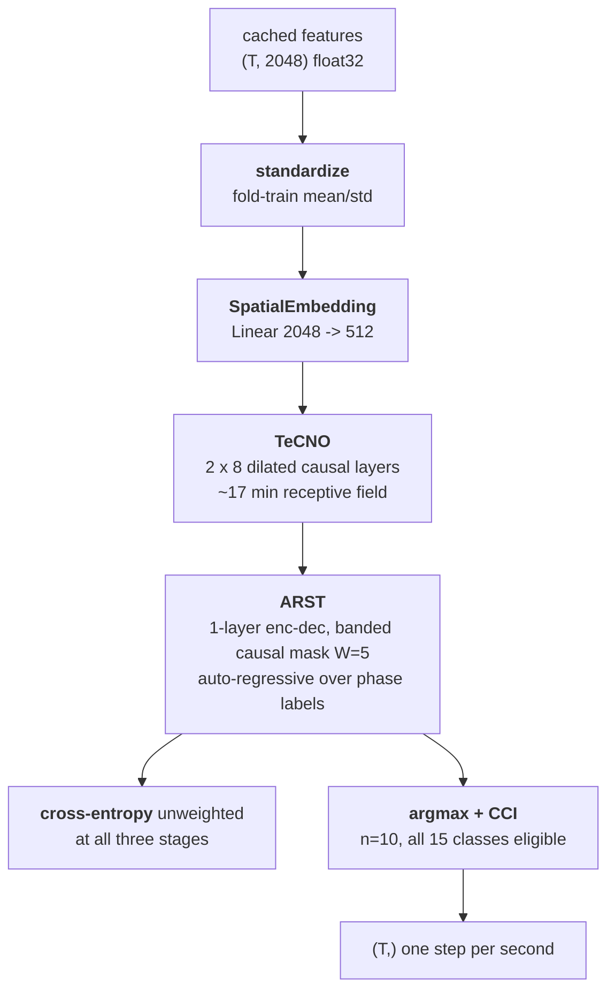
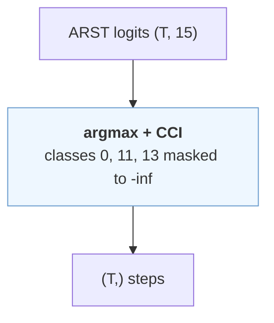
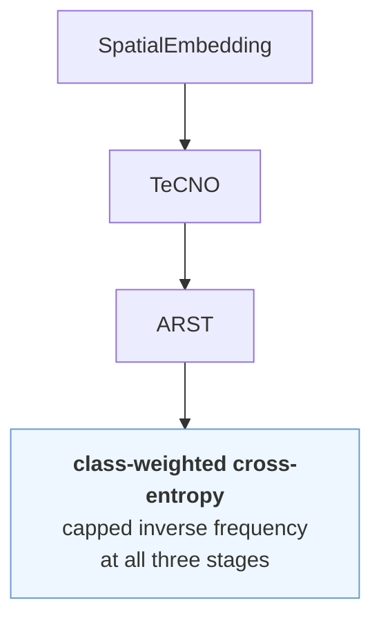
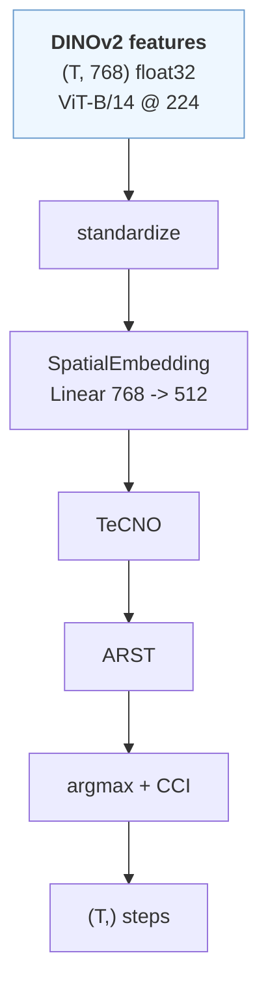

# Step variants — the iteration on top of ARST

The task-1 counterpart to [`instrument-variants.md`](instrument-variants.md),
and the same protocol. [`citi-baseline.md`](citi-baseline.md) stays the CITI
reproduction; this is what we tried to beat it with.

Code: `src/pitvis/training/arst_v2.py`, `src/pitvis/training/crossval.py`.

---

## 1. What was wrong

ARST reproduces at **0.3425** on the five validation videos. Table 8 benchmarks
CITI at **70** on those same five. That is the same ~50% shortfall instrument
recognition had, and the two reproductions share exactly one deviation from
their published counterparts: a frozen ImageNet backbone.

The per-class failure has the same shape too — from `citi-baseline.md`, step 3
(septum displacement) and step 9 (synthetic graft) at **0.000 recall**, step 6
(durotomy) at 0.036 — against an unweighted cross-entropy trained over a
distribution running 23.9% (tumour excision) to 0.06% (nasal packing).

And one lever had been sitting unclaimed. `CLAUDE.md` records that masking
classes 0/11/13 out of the argmax **"can only raise the official metric"** —
the metric filters by ground truth only and calls `f1_score` with no `labels=`,
so predicting an excluded class joins the macro average at F1 = 0. It existed
only as an ablation flag, off by default.

---

## 2. Protocol

Identical to task 2, and shared code: 5-fold cross-validation over the same
frozen folds (`data/folds.py`), each of the 19 training videos held out exactly
once, aggregated per-video-then-mean by one `evaluation.metric.evaluate` call.
VAL scored **once**, for the winner. `macro_f1` ranks; the official `metric`
is guarded against regression beyond one std of the 19-video spread.

The harness is task-agnostic — `crossval.Task` holds the loader, the scorer and
which metric ranks, so the fold logic and the leaderboard are shared rather
than copied.

---

## 3. The variants

**control** — ARST unchanged, the anchor.

**masked** — the decision node only: `0/11/13` removed from the argmax, so an
excluded class can never be emitted onto a scored row.

**weighted** — the loss node only: capped inverse-frequency class weights at
all three stages, computed on the fold's own training videos. Capped at 10 for
the same reason task 2's `pos_weight` is capped at 50 — nasal packing is 0.06%
of frames, so an uncapped weight lands in the thousands.

**dinov2** — the input node only: `(T, 768)` DINOv2 ViT-B/14 features.

**best** — masking + class weights on DINOv2.

---

## 4. Results

### Leaderboard — 19 out-of-fold training videos

| variant | space | macro_f1 | edit_score | metric |
|---|---|---|---|---|
| **best @ dinov2** | dinov2_vitb14 | **0.5044**±0.103 | **0.5789**±0.114 | **0.5417**±0.092 |
| best | resnet50 | 0.4909±0.121 | 0.5218±0.126 | 0.5063±0.109 |
| masked | resnet50 | 0.4667±0.103 | 0.5127±0.123 | 0.4897±0.098 |
| weighted | resnet50 | 0.4393±0.113 | 0.4404±0.080 | 0.4399±0.076 |
| dinov2 | dinov2_vitb14 | 0.4337±0.095 | 0.4322±0.096 | 0.4329±0.082 |
| control (ARST) | resnet50 | 0.4047±0.093 | 0.4282±0.081 | 0.4164±0.076 |

### The pattern reproduced

**DINOv2 alone gains +0.029 macro — inside control's ±0.093 spread and inside
the ±0.076 guard tolerance.** On its own it is indistinguishable from noise.
Composed with masking and class weights it is the best variant on all three
metrics, and beats the same composition on ResNet-50.

That is exactly what happened on task 2 (+0.021 alone, +0.055 composed). **Two
tasks, same shape**: the representation only pays once the loss and the
decision rule stop masking it. It is a strong argument for never running a
backbone swap first — the null result is real and it is misleading.

**Masking was the largest single lever** at +0.062 macro / +0.073 metric, and
it is not a model change at all. It had been available as an ablation flag,
off by default, since before any of this work.

### Per class — where it moved

| step | name | support | control | best |
|---|---|---|---|---|
| 3 | septum displacement | 986 | 0.007 | **0.167** |
| 14 | debris clearance | 659 | 0.228 | **0.421** |
| 10 | fat graft placement | 1,905 | 0.466 | **0.582** |
| 1 | nasal corridor creation | 2,325 | 0.650 | 0.752 |
| 7 | tumour excision | 17,875 | 0.664 | **0.588** |
| 8 | haemostasis | 9,451 | 0.549 | **0.512** |
| 9 | synthetic graft placement | 2,696 | 0.278 | **0.224** |

**Three classes regress**, and that is the expected cost rather than a
surprise: reweighting moves capacity away from the dominant classes, and tumour
excision alone is 23.9% of frames. The macro average says the trade is worth
taking; a support-weighted reading would not.

### The single VAL scoring

| | ARST (control) | winner | delta |
|---|---|---|---|
| challenge `metric` | 0.3425 | **0.4610**±0.043 | **+0.119** |
| macro F1 | 0.3083 | **0.4420**±0.079 | +0.134 |
| edit score | 0.3767 | **0.4801**±0.041 | +0.103 |

Against Table 8's **70** for CITI on these same five videos, 46.1 is still well
short — the frozen backbone remains the untested lever (roadmap 1.7/3.6).

---

## 5. What this did not test

- **Backbone fine-tuning.** Still the largest untested lever, and the DINOv2
  interaction above is now evidence *for* it rather than against.
- **Per-class decision thresholds**, which paid on task 2. Steps are
  multi-class with a single argmax rather than 15 independent sigmoids, so the
  equivalent is a prior-corrected argmax — untried.
- **Generalisation past the training split.** CV ranks on training videos; the
  paper reports −7 points val→test for steps, milder than instruments' −47 but
  not nothing.

---

## 6. The fine-tuned backbone, scored once on VAL

The `best` recipe on `resnet50_ft` (5-epoch fine-tuned ResNet-50) instead of
frozen DINOv2 — `data/arst/v2/best@resnet50_ft/`:

| | frozen DINOv2 | fine-tuned ResNet-50 | Δ |
|---|---|---|---|
| **challenge metric** | **0.4610** ±0.043 | 0.4425 ±0.050 | −0.019 |
| macro F1 | 0.4420 | **0.4658** | +0.024 |
| edit score | **0.4801** | 0.4193 | −0.061 |

Both deltas sit inside one std of the spread, so on steps this is a wash rather
than a loss. The shape is worth noting though: macro goes up while **edit goes
down by three times as much**. The fine-tuned encoder is fractionally better at
naming the step in a given second and materially worse at holding a segment
together, which is what the edit score measures — more, shorter runs.

That fits what the encoder was trained to do: `backbone.py` fine-tunes on
single frames with a per-frame cross-entropy and no temporal term at all, so
nothing in its objective rewards a representation that is stable second to
second. It is the same trade the AP probe predicts — better per-frame
discrimination — arriving with a cost the probe cannot see.

Same caveat as task 2: both arms are single VAL measurements, not a ranking. A
CV over `resnet50_ft` is unavailable because one encoder trained on all of TRAIN
leaks into every fold.

---

## 7. Fine-tuned DINOv2 — the encoder experiment, and why it failed

`best` on `dinov2_ft` (DINOv2 ViT-B fine-tuned 50 epochs on the frame cache),
VAL scored once — `data/arst/v2/best@dinov2_ft/`:

| | frozen DINOv2 | fine-tuned ResNet-50 | fine-tuned DINOv2 |
|---|---|---|---|
| **challenge metric** | **0.4610** ±0.043 | 0.4425 ±0.050 | 0.3500 ±0.105 |
| macro F1 | 0.4420 | **0.4658** | 0.3631 |
| edit score | **0.4801** | 0.4193 | 0.3369 |

Worse on every metric, and by more than the fold spread. The per-video std also
doubles (±0.105 against ±0.043), so it is less stable as well as lower.

The cause is in the representation, not the temporal model: the AP probe puts
mean AP at 0.270 against frozen DINOv2's 0.350, with only 3 of 19 classes
improved. Fine-tuning overwrote a representation that was already better than
this dataset can teach. Full account, including what would have to change to
test the idea properly, in
[`instrument-variants.md` §6](instrument-variants.md).

The pooled per-class table shows the damage where the classes are thin —
septum displacement and durotomy collapse to 0.000 and 0.071 F1 respectively,
having been learnable on frozen features.

---

## 8. Logit adjustment — task 2's best idea does not transfer

Task 2's largest modelling gain was per-class thresholds (+0.099 macro), and
task 1 had no equivalent: one argmax over 15 classes whose priors span 23.9%
(tumour excision) to 0.06% (nasal packing). The per-class recalls looked like
exactly that problem — 0.907 for sphenoid sinus clearance against 0.040 for
durotomy and 0.000 for septum displacement.

The multi-class analogue is **logit adjustment** (Menon et al. 2021):
subtract `tau * log(prior)` at inference, computed on the fold's training
labels only. Rare classes get a larger boost — nasal packing +7.07 against
tumour excision +1.555 at tau=1.

**It does not help.** Cross-validated over the same frozen folds:

| variant | macro | edit | metric |
|---|---|---|---|
| best (no adjustment) | **0.5044**±0.103 | 0.5789 | **0.5417**±0.092 |
| tau = 0.5 | 0.4927±0.107 | 0.5782 | 0.5355±0.094 |
| tau = 1.0 | 0.4732±0.127 | 0.5744 | 0.5238±0.114 |

Both are inside the fold spread, so the honest reading is "no effect" — but
the direction is consistent and **monotone in tau**, which noise would not be.
More adjustment, worse macro.

**Why it transfers badly, and the test that would confirm it.** Task 2 is
multi-LABEL: nineteen independent sigmoids, each with its own bar, so moving
one class's threshold costs nothing elsewhere. Task 1 is multi-CLASS with a
single argmax, where every unit given to a rare class is taken from a frequent
one directly.

More specifically, the suspicion is **double correction**. `best` already
carries inverse-frequency class weights in the cross-entropy at all three
stages — a training-time prior correction. Applying an inference-time prior
correction on top pushes past the optimum rather than toward it, which is
exactly the monotone degradation observed.

*Test:* run the adjustment on `masked` without class weights. If it helps
there and hurts here, double correction is confirmed and the useful version is
"correct once, in either place, not both". Untested — the two CV runs needed
are ~9 minutes each.

Note the edit score barely moves (0.5789 → 0.5782), so the adjustment is not
shattering segments; the whole cost is per-frame macro F1.
