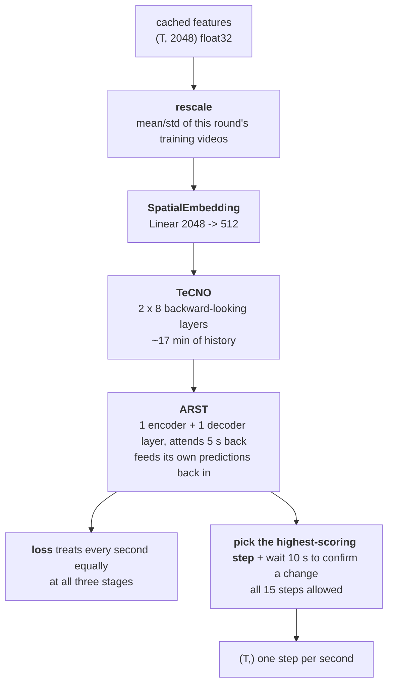
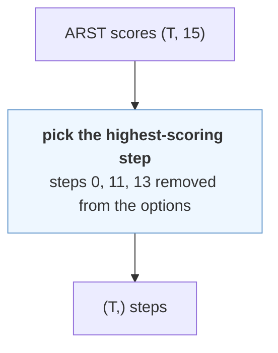
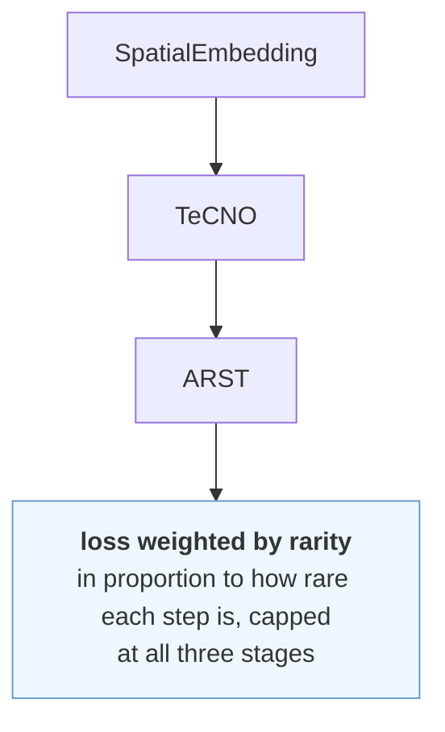
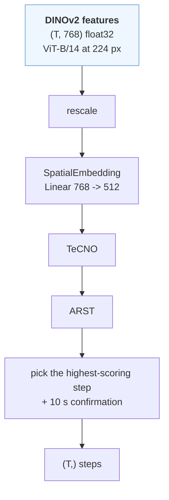

# Step variants — what we tried to beat ARST with

The task-1 counterpart to [`instrument-variants.md`](instrument-variants.md),
run the same way. [`citi-baseline.md`](citi-baseline.md) stays the CITI
reproduction; this note is the attempts to improve on it.

Code: `src/pitvis/training/arst_v2.py`, `src/pitvis/training/crossval.py`.

Two names used throughout. **Macro F1** scores each step separately and then
averages, so a step that covers 0.06% of the surgery counts as much as one that
covers 24%. The **edit score** ignores exactly when each step happens and asks
whether the *sequence* of steps is right, so it punishes a prediction that
flickers between steps second by second. The challenge metric is the two
averaged. What each measures and why the challenge chose them is in
[`../reference/metrics.md`](../reference/metrics.md).

---

## 1. What was wrong

ARST reproduces at **0.3402** on the five validation videos. Table 8 benchmarks
CITI at **70** on those same five. That is the same shortfall of roughly half
that instrument recognition had, and the two reproductions differ from their
published versions in exactly one way: the frame encoder is never trained. It
keeps the weights it learned on ImageNet photographs and only the layers after
it are fitted.

The per-step failures have the same shape too — from `citi-baseline.md`, step 3
(septum displacement) and step 9 (synthetic graft) are never predicted at all,
and step 6 (durotomy) almost never — against a loss that treated every second
as equally important, over steps ranging from 23.9% of the surgery (tumour
excision) down to 0.06% (nasal packing).

And one change had been sitting there unused. `CLAUDE.md` records that
forbidding the model from ever predicting steps 0, 11 and 13 **"can only raise
the official metric"** — the scorer removes those steps from the *truth* but not
from the predictions, and it does not tell the F1 function which labels exist,
so predicting one of them adds a zero to the average. It existed only as a
switch for turning it on in experiments, off by default.

---

## 2. How the variants were compared

The same as task 2, using the same code: five rounds of training, each holding
out a different group of the 19 training videos (`data/folds.py` fixes the
groups so every variant sees the identical split). Each video is scored on its
own and the scores are then averaged, never pooled. The five validation videos
were scored **once**, for the winner only.

Macro F1 decides the ranking. The challenge metric acts as a guard: a variant
must not fall more than one standard deviation of the 19-video spread below the
control on it, because the challenge metric is dominated by the common steps and
a variant can lift the rare ones while lowering it.

The same code runs both tasks — `crossval.Task` holds the data loader, the
scorer and which number ranks, so the round-splitting and the results table are
shared rather than copied.

---

## 3. The variants

```mermaid
flowchart TD
    F["cached features<br/>(T, 2048) float32"]
    STD["<b>rescale</b><br/>mean/std of this round's training videos"]
    SP["<b>SpatialEmbedding</b><br/>Linear 2048 -> 512"]
    TC["<b>TeCNO</b><br/>2 x 8 backward-looking layers<br/>~17 min of history"]
    AR["<b>ARST</b><br/>1 encoder + 1 decoder layer, attends 5 s back<br/>feeds its own predictions back in"]
    CE["<b>loss</b> treats every second equally<br/>at all three stages"]
    D["<b>pick the highest-scoring step</b> + wait 10 s to confirm a change<br/>all 15 steps allowed"]
    P["(T,) one step per second"]
    F --> STD --> SP --> TC --> AR --> CE
    AR --> D --> P
```

**control** — ARST unchanged, the thing to beat.

**masked** — changes only how the answer is chosen: steps 0, 11 and 13 are
removed from the options, so one of them can never be predicted onto a scored
second.

```mermaid
flowchart TD
    AR["ARST scores (T, 15)"]
    D["<b>pick the highest-scoring step</b><br/>steps 0, 11, 13 removed from the options"]
    P["(T,) steps"]
    AR --> D --> P
    style D fill:#eef7ff,stroke:#69c
```

**weighted** — changes only the loss: rarer steps count for more, in proportion
to how rare they are, at all three stages, measured on that round's own
training videos. The weight is capped at 10 for the same reason task 2's is
capped at 50 — nasal packing is 0.06% of seconds, so an uncapped weight would
run into the thousands.

```mermaid
flowchart TD
    SP["SpatialEmbedding"] --> TC["TeCNO"] --> AR["ARST"]
    CE["<b>loss weighted by rarity</b><br/>in proportion to how rare each step is, capped<br/>at all three stages"]
    AR --> CE
    style CE fill:#eef7ff,stroke:#69c
```

**dinov2** — changes only the input: `(T, 768)` features from DINOv2 ViT-B/14
instead of ResNet-50.

```mermaid
flowchart TD
    F["<b>DINOv2 features</b><br/>(T, 768) float32<br/>ViT-B/14 at 224 px"]
    STD["rescale"] --> SP["SpatialEmbedding<br/>Linear 768 -> 512"]
    SP --> TC["TeCNO"] --> AR["ARST"] --> D["pick the highest-scoring step<br/>+ 10 s confirmation"] --> P["(T,) steps"]
    F --> STD
    style F fill:#eef7ff,stroke:#69c
```

**best** — the masking and the rarity weighting together, on DINOv2 features.

---

## 4. Results

### The table — 19 training videos, each scored when held out

| variant | features | macro_f1 | edit_score | metric |
|---|---|---|---|---|
| **best @ dinov2** | dinov2_vitb14 | **0.5044**±0.103 | **0.5789**±0.114 | **0.5417**±0.092 |
| best | resnet50 | 0.4909±0.121 | 0.5218±0.126 | 0.5063±0.109 |
| masked | resnet50 | 0.4667±0.103 | 0.5127±0.123 | 0.4897±0.098 |
| weighted | resnet50 | 0.4393±0.113 | 0.4404±0.080 | 0.4399±0.076 |
| dinov2 | dinov2_vitb14 | 0.4337±0.095 | 0.4322±0.096 | 0.4329±0.082 |
| control (ARST) | resnet50 | 0.4047±0.093 | 0.4282±0.081 | 0.4164±0.076 |

### The same pattern as task 2

**Better features on their own gain +0.029 macro — inside the control's ±0.093
spread and inside the ±0.076 the guard allows.** On its own the change cannot
be told apart from run-to-run variation. Combined with the masking and the
rarity weighting it is the best variant on all three numbers, and beats the
same combination built on ResNet-50.

That is exactly what happened on task 2 (+0.021 on its own, +0.055 combined).
**Two tasks, the same shape**: better features only pay off once the loss and
the choice of answer stop throwing the extra information away. It is a strong
argument against testing a change of encoder first — the "no effect" result is
real and it is misleading.

**The masking was the biggest single change** at +0.062 macro and +0.073 on the
challenge metric, and it is not a change to the model at all. It had been
available as an off-by-default switch since before any of this work.

### Step by step — where it moved

| step | name | seconds | control | best |
|---|---|---|---|---|
| 3 | septum displacement | 986 | 0.007 | **0.167** |
| 14 | debris clearance | 659 | 0.228 | **0.421** |
| 10 | fat graft placement | 1,905 | 0.466 | **0.582** |
| 1 | nasal corridor creation | 2,325 | 0.650 | 0.752 |
| 7 | tumour excision | 17,875 | 0.664 | **0.588** |
| 8 | haemostasis | 9,451 | 0.549 | **0.512** |
| 9 | synthetic graft placement | 2,696 | 0.278 | **0.224** |

**Three steps get worse**, and that is the expected price rather than a
surprise: telling the model to care more about rare steps takes attention away
from common ones, and tumour excision alone is 23.9% of seconds. Macro F1 says
the trade is worth making; a score weighted by how common each step is would
not.

### The one scoring on the validation videos

| | ARST (control) | winner | difference |
|---|---|---|---|
| challenge `metric` | 0.3402 | **0.4610**±0.043 | **+0.121** |
| macro F1 | 0.3255 | **0.4420**±0.079 | +0.117 |
| edit score | 0.3548 | **0.4801**±0.041 | +0.125 |

Against Table 8's **70** for CITI on these same five videos, 46.1 is still well
short — training the frame encoder was the untried change at this point. §7
tries it, and closes about half of what is left.

> **The saved model on disk is not this model.** `data/arst/v2/best/` holds a
> later, unrecorded re-run (2026-08-11 12:02) scoring **0.4196 ±0.0565** — macro
> 0.3998, edit 0.4394 — against the 0.4610 ±0.043 recorded above. It is also the
> default: `pitvis-predict --list-models` resolves `arst-v2:best` to it, so the
> app and every prediction use the weaker one.
>
> The difference is in the *training*, not in the record-keeping. `result.json`
> describes its own `model.pt` correctly — re-scoring those weights with
> `uv run pitvis-eval --ckpt data/arst/v2/best/model.pt` reproduces all three
> numbers to four decimals. The recorded 0.4610 is equally real: `4d56a7c`
> produced it and `3fcb8cc` retrained the winner and got it again. Nothing
> between those commits and 2026-08-11 touched `arst_v2.py`, so the likeliest
> cause is that runs simply vary, and 0.042 sits inside the ±0.0565 spread.
>
> **It is not the only case**, though it is the larger half of the problem. The
> instrument winner moves the same way (0.5572 to 0.4962 on the official
> number, while its macro goes *up*). The two reproductions do not: both match
> their own notes exactly. The full table is in
> [`current-state.md`](../current-state.md) §5, gap 8.
>
> Two things follow. **Quote 0.4196 for anything the saved model does**, and
> 0.4610 only as the result of the run this table describes. And the seed is not
> fixing what it appears to fix — `--seed 0` was set for both runs, so a re-run
> does not reproduce on this machine. Neither point is settled by editing a
> note; both need re-runs, more than one ideally.

---

## 5. What this did not test

- **Training the frame encoder.** The biggest untried change at the time, and
  the way better features behaved above is evidence *for* it rather than
  against. §7 now tries it — twice — and it is where the largest gain in this
  note comes from.
- **A separate bar per step**, which paid off on task 2. Steps are exclusive:
  one answer is chosen from 15, rather than 15 independent yes/no decisions. The
  nearest equivalent is to shift the scores by how common each step is before
  choosing — see §8, which tried it.
- **Whether any of this holds outside the training videos.** The rounds rank
  variants on training videos only; the paper reports a 7-point drop from
  validation to test for steps, milder than instruments' 47 but not nothing.

---

## 6. A trained ResNet-50, scored once on the validation videos

The `best` recipe on `resnet50_ft` (a ResNet-50 trained for 5 epochs on the
surgical frames) instead of the untrained DINOv2 —
`data/arst/v2/best@resnet50_ft/`:

| | untrained DINOv2 | trained ResNet-50 | Δ |
|---|---|---|---|
| **challenge metric** | **0.4610** ±0.043 | 0.4425 ±0.050 | −0.019 |
| macro F1 | 0.4420 | **0.4658** | +0.024 |
| edit score | **0.4801** | 0.4193 | −0.061 |

Both differences sit inside one standard deviation of the spread, so on steps
this is a draw rather than a loss. The shape is worth noting though: macro goes
up while the **edit score goes down by three times as much**. The trained
encoder is slightly better at naming the step in any given second and clearly
worse at keeping a run of seconds on the same step — which is what the edit
score measures, so it produces more and shorter runs.

That fits what the encoder was trained to do: `backbone.py` trains it on single
frames, judging each one on its own, with nothing in its goal rewarding answers
that stay steady from one second to the next. It is the same trade the ranking
test predicts — better frame-by-frame separation — arriving with a cost that
test cannot see.

Same caveat as task 2: both columns are single measurements on the validation
videos, not a ranking. Comparing them properly over the training rounds is not
possible, because one encoder trained on all the training videos has already
seen every round's held-out videos.

---

## 7. A trained DINOv2 — the encoder experiment, twice

The same idea run twice with one difference — how the training was set up — and
that difference separates the worst result in this note from the best. Both are
`best` on `dinov2_ft`, each scored once on the validation videos,
`data/arst/v2/best@dinov2_ft/`.

| | untrained DINOv2 | trained ResNet-50 | trained DINOv2 **run 1** | trained DINOv2 **run 2** |
|---|---|---|---|---|
| **challenge metric** | 0.4610 ±0.043 | 0.4425 ±0.050 | 0.3500 ±0.105 | **0.5608** ±0.052 |
| macro F1 | 0.4420 | 0.4658 | 0.3631 | **0.6147** |
| edit score | 0.4801 | 0.4193 | 0.3369 | **0.5068** |

**Run 2 is the largest single gain in the project — +0.0998 on the challenge
metric, +0.173 on macro.** No single change in §4 comes close; the largest
there was the masking, at +0.073 on the metric.

Against §4's changes *combined* the two numbers disagree, and the disagreement
is worth keeping rather than rounding away. The masking, the rarity weighting
and the change of features together moved macro from 0.3255 to 0.4420 (+0.117)
and the challenge metric from 0.3402 to 0.4610 (+0.121). So training the
encoder beats all of them combined on macro (+0.173 against +0.117) but **not**
on the challenge metric (+0.0998 against +0.121). Macro is what ranks here, so
"largest gain in the project" stands — but it is a claim about macro, not about
the headline number.

### Run 1 — why it failed

Worse on every number, by more than the spread between rounds, with the spread
between videos doubled (±0.105 against ±0.043). The cause was the features, not
the model on top: the ranking test put average precision at 0.270 against
untrained DINOv2's 0.350, with only 3 of 19 classes improved. Fifty epochs at
one flat learning rate, with no validation anywhere in the loop, overwrote
features that were better than 84,666 frames can teach. The damage landed on
the thin steps — septum displacement and durotomy at 0.000 and 0.071 F1, both
learnable from the untrained features.

### Run 2 — what changed, and what it bought

A lower learning rate for the encoder that falls off further down the network,
a slow start, and stopping early based on three training videos held aside
whole. It stopped at **epoch 2**. The setup and the reasoning are in
[`instrument-variants.md` §6](instrument-variants.md) — the ranking test there
is the bar this had to clear (0.350 to 0.523, all 19 classes improved) before
any step number existed.

Per-step F1 pooled across the five validation videos, untrained against
trained:

| step | name | seconds | untrained | **run 2** | Δ |
|---|---|---|---|---|---|
| 6 | durotomy | 1,419 | 0.000 | **0.573** | **+0.573** |
| 5 | sellotomy | 3,034 | 0.240 | **0.604** | +0.364 |
| 14 | debris clearance | 349 | 0.303 | **0.623** | +0.320 |
| 3 | septum displacement | 351 | 0.064 | **0.279** | +0.215 |
| 9 | synthetic graft placement | 840 | 0.142 | **0.349** | +0.207 |
| 7 | tumour excision | 9,720 | 0.767 | **0.924** | +0.157 |
| 12 | dural sealant | 184 | 0.332 | **0.482** | +0.150 |
| 8 | haemostasis | 4,266 | 0.530 | **0.674** | +0.144 |
| 10 | fat graft placement | 343 | 0.509 | **0.636** | +0.127 |
| 4 | sphenoid sinus clearance | 4,229 | 0.637 | **0.717** | +0.080 |
| 2 | anterior sphenoidotomy | 2,678 | 0.851 | 0.845 | −0.006 |
| 1 | nasal corridor creation | 512 | 0.922 | 0.894 | −0.028 |

**Eleven of the twelve scored steps improve, and durotomy comes back from
nothing** — 0.000 F1 to 0.573. That is the signature this whole line of work
was after: not a choice rule trading one step against another, but steps
becoming *visible* that were not. The two that get worse are the two already
above 0.85, and both move by less than the run-to-run variation.

**Every earlier gain in this note moved accuracy from one step to another; this
one does not.** §4's per-step table shows the masking and the rarity weighting
buying rare-step F1 by giving up tumour excision (0.664 to 0.588) and
haemostasis (0.549 to 0.512). Here tumour excision goes *up* by 0.157 at the
same time as durotomy goes up by 0.573. Better features are the only change
that moves both ends at once.

### What this result is not

**It is one measurement on the validation videos, not a ranking across
rounds.** Same limit as §6: a single encoder trained on all 19 training videos
has seen every round's held-out videos, so `crossval.check_no_leak` refuses the
setup. The honest version is six separate trainings — one per round plus one
overall — costing about six times the GPU time. See
[`infra/README.md`](../../infra/README.md).

**It also cannot be compared with the rows above it on equal terms.** The
untrained-DINOv2 row was picked by the round-based comparison and then measured
once; this row was measured once with nothing picked on it, which is *cleaner*
rather than worse — but the two differ in how much choosing sits behind them.
What makes the result believable anyway is that the bar was set before the run:
the ranking test had to clear 0.350, and it cleared it by 0.173.

---

## 8. Shifting the scores by how common each step is — task 2's best idea does not carry over

Task 2's biggest gain from changing the model's behaviour was giving each
instrument its own bar (+0.099 macro), and task 1 had no equivalent: one choice
among 15 steps whose frequencies run from 23.9% (tumour excision) to 0.06%
(nasal packing). The per-step recalls looked like exactly that problem — 0.907
for sphenoid sinus clearance against 0.040 for durotomy and 0.000 for septum
displacement.

The version of the idea that fits one exclusive choice is **logit adjustment**
(Menon et al. 2021): before picking the winner, subtract `tau * log(prior)`
from each step's score, where the frequencies come only from that round's
training labels. Rare steps get the larger boost — nasal packing +7.07 against
tumour excision +1.555 at tau=1.

**It does not help.** Compared over the same fixed rounds:

| variant | macro | edit | metric |
|---|---|---|---|
| best (no shift) | **0.5044**±0.103 | 0.5789 | **0.5417**±0.092 |
| tau = 0.5 | 0.4927±0.107 | 0.5782 | 0.5355±0.094 |
| tau = 1.0 | 0.4732±0.127 | 0.5744 | 0.5238±0.114 |

Both sit inside the spread between rounds, so the honest reading is "no
effect" — but the direction is consistent and gets steadily worse as the shift
grows, which variation alone would not do.

**Why it carries over badly, and the test that would confirm it.** On task 2
each of the nineteen instruments is judged on its own, with its own bar, so
moving one costs nothing elsewhere. Task 1 picks one step out of 15, so every
bit of advantage given to a rare step is taken directly from a common one.

More specifically, the suspicion is **correcting twice**. `best` already weights
rare steps more heavily in the loss at all three stages — a correction applied
during training. Applying a second correction when choosing the answer pushes
past the best point rather than towards it, which is exactly the steady
worsening seen above.

*The test, now run.* The same recipe with the rarity weighting removed, with
and without the shift:

| | rarity weighting | shift | macro | edit | metric |
|---|---|---|---|---|---|
| best | yes | — | **0.5044** | 0.5789 | **0.5417** |
| prior-half | yes | tau=0.5 | 0.4927 | 0.5782 | 0.5355 |
| masked-dinov2 | no | — | 0.4902 | 0.5050 | 0.4976 |
| prior-noweight | no | tau=0.5 | 0.4850 | **0.5236** | 0.5043 |

**Correcting twice is confirmed, and it changes what the shift is for.** With
the rarity weighting present the shift costs 0.0062 on the metric; with it
removed the shift *gains* 0.0067 on the metric and 0.0186 on the edit score.
The sign flips on whether the frequencies have already been corrected for once.
Correcting in both places is worse than correcting in either.

But the useful conclusion is the other comparison: **the rarity weighting is
the better of the two corrections.** Weighting alone against neither is +0.0142
macro and +0.0441 metric; the shift alone is roughly a draw. Correcting during
training beats correcting when choosing on this task, which is the opposite of
task 2 — where the gain was in the choice, because nineteen separate yes/no
decisions each have a bar to move and one exclusive choice does not.

Every difference here sits inside the spread between rounds (±0.09 to 0.13), so
none of it is significant on its own. What carries the argument is the pattern:
steadily worse as the shift grows, and a sign that flips exactly when the other
correction is removed. `best` stays the winner.

Note also the shift's one consistent effect is on the EDIT score, which rises in
both cases where it is applied (+0.0186 without the weighting, −0.0007 with).
It makes the sequence slightly steadier and the second-by-second decisions
slightly worse — the reverse of the trade training the encoder made.
