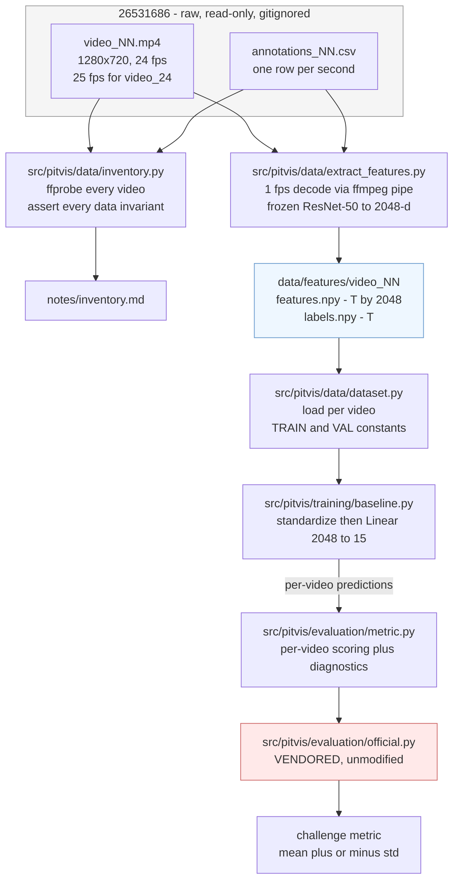
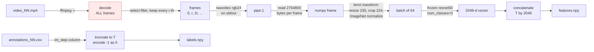
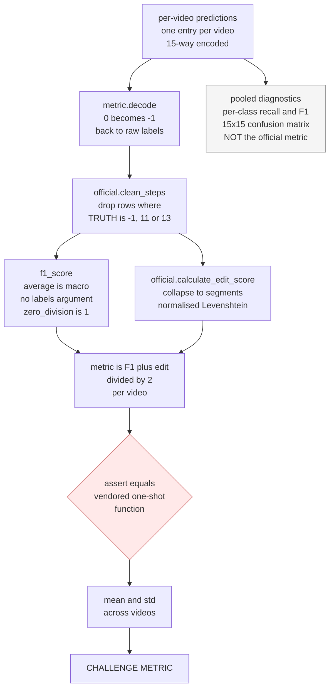

# Walkthrough: the data, the pipeline, and where to look

A guide for reading this repository end to end. `CLAUDE.md` is the terse record of
*decisions*; this document explains the *reasoning* and the domain, and points at
specific code. Every `file.py:NN` reference below is a real line — follow them.

Companion: [`embeddings.md`](embeddings.md) — a ground-up explanation of what the
feature cache is and how an embedding is generated. Start there if §8 assumes more
than you want it to.

**Contents**

1. [The clinical task](#1-the-clinical-task)
2. [What the raw data actually is](#2-what-the-raw-data-actually-is)
3. [The 14 steps, in plain terms](#3-the-14-steps-in-plain-terms)
4. [Instruments](#4-instruments)
5. [Temporal structure — the most important section](#5-temporal-structure--the-most-important-section)
6. [Pipeline overview](#6-pipeline-overview)
7. [Stage 1 — inventory](#7-stage-1--inventory)
8. [Stage 2 — feature extraction](#8-stage-2--feature-extraction)
9. [The off-by-one, drawn out](#9-the-off-by-one-drawn-out)
10. [Stage 3 — dataset and split](#10-stage-3--dataset-and-split)
11. [Stage 4 — the baseline model](#11-stage-4--the-baseline-model)
12. [Stage 5 — evaluation](#12-stage-5--evaluation)
13. [A worked metric example](#13-a-worked-metric-example)
14. [Suggested trace plan](#14-suggested-trace-plan)
15. [What is not built yet](#15-what-is-not-built-yet)

---

## 1. The clinical task

The dataset is video of the **endoscopic transsphenoidal approach** (eTSA) — the standard
route for removing a pituitary tumour. The surgeon does not open the skull. An endoscope
goes in through the nostril, drills forward through the sphenoid sinus, opens the bony floor
of the sella turcica (the pocket the pituitary sits in), cuts the dura, removes the tumour,
and then rebuilds the barrier so cerebrospinal fluid does not leak out through the nose.

So a single video is one continuous camera feed from inside the nose and skull base, one to
two and a half hours long.

**The task**: for every second of that video, say which surgical step is happening. This is
"workflow recognition" — the point is not diagnosis but understanding the *structure* of the
operation, which is what enables surgical training feedback, automated operative notes,
timing/efficiency analysis, and eventually intra-operative assistance.

Two properties of the domain that matter for modelling:

- **A step is a long stretch of time, not an event.** Median step segment is 43 seconds.
- **The camera leaves the patient repeatedly.** The scope is withdrawn to wipe the lens,
  swap instruments, or re-orient. Those seconds are labelled background, and they appear
  *throughout* the operation, not just at the ends. This is why background is 9% of the data
  and why it interleaves with every step (see §5).

---

## 2. What the raw data actually is

`26531686/` — 53 files, 40 GB, gitignored, treat as read-only. The name is the Figshare
deposit ID.

```
26531686/
  video_{01..25}.mp4          25 videos, 1280x720 H.264
  annotations_{n}.csv         24 files — annotations_19.csv is MISSING
  map_steps.csv               int -> step name
  map_instruments.csv         int -> instrument name  (note: plural)
  README.txt                  two paragraphs, points at the paper and the challenge
  video_encoder_details.txt   claims "constant framerate (24)" — this is WRONG, see below
```

### The annotation schema

Five integer columns, no nulls, verified across all 24 files by `src/pitvis/data/inventory.py:50`.
The first rows of `annotations_01.csv`:

```
int_video,int_time,int_step,int_instrument1,int_instrument2
1,0,-1,-1,-2      <- second 0: scope not yet in the patient
1,1,-1,-1,-2
1,2,-1,-1,-2
1,3,1,0,-2        <- second 3: step 1 begins, no instrument visible yet
1,4,1,0,-2
1,5,1,0,-2
1,6,1,16,-2       <- second 6: suction (16) appears
```

| column | meaning |
|---|---|
| `int_video` | constant per file, matches the filename |
| `int_time` | **elapsed seconds**, contiguous `0..N-1`. Not a frame index, not a timestamp string |
| `int_step` | one integer in `{-1} ∪ {1..14}`. **There is no step 0** |
| `int_instrument1` | primary instrument in view |
| `int_instrument2` | secondary instrument, or `-2` for "none" (85.3% of rows) |

Two things to internalise:

**`int_time` is seconds, and there is exactly one row per second.** So an annotation file is
already a 1 Hz label sequence. This is *why* the whole pipeline samples video at 1 fps —
we're matching the label rate, not choosing a rate for computational convenience.

**The instrument label is a pair of columns, not a list.** `-2` in the second column means
"only one instrument". The pair is sorted ascending except in 4 rows dataset-wide.

### Background is one state with three names

`map_steps.csv` maps `-1` to **three** different strings:

```
-1,operation_ended
-1,operation_not_started
-1,out_of_patient
```

The CSV collapses all three into the single integer `-1`, so **the distinction is
unrecoverable** from the annotations. There is no way to tell "we haven't started" from
"scope temporarily withdrawn". We treat `-1` as one background class and move on.

`map_instruments.csv` has the same problem at `0` (`no_visible_instrument` and
`occluded_image_inside_patient`).

This is why `src/pitvis/data/inventory.py:100-102` builds the name lookup with `setdefault` rather than
a dict comprehension — a naive `dict(zip(ids, names))` would silently keep only the last
name for each colliding key. If you load these maps yourself, handle the collision.

### Traps worth knowing before you touch anything

| trap | reality |
|---|---|
| `video_encoder_details.txt` says 24 fps | **`video_24.mp4` is 25 fps.** Read fps per video or your labels shift |
| step 1's name | has a **trailing space**: `"nasal corridor creation "`. Always `.strip()` |
| step 0 | does not exist. Steps are 1–14, background is -1 |
| `annotations_19.csv` | missing from the download entirely (see `CLAUDE.md`) |
| `map_instrument.csv` | README calls it that; the actual file is `map_instruments.csv` |
| annotation rows vs frames | off by exactly one, every video. See §9 |

The consistency check worth knowing about: `int_step == -1` and `int_instrument1 == -1`
coincide **exactly** — 10,476 rows, zero disagreement either way. Background is one coherent
state across both label tracks, and `src/pitvis/data/inventory.py:58-60` asserts it. It also
cross-checks: 9.06% of 115,586 labelled seconds = 10,476.

---

## 3. The 14 steps, in plain terms

Grouped by what the surgeon is doing. Percentages are of all 115,586 labelled seconds.

**Getting in — through the nose and the sinus**

| # | name | % | what it is |
|---|---|---|---|
| 1 | nasal corridor creation | 2.45 | opening a working channel through the nostril |
| 2 | anterior sphenoidotomy | 9.32 | opening the front wall of the sphenoid sinus |
| 3 | septum displacement | 1.16 | moving the nasal septum aside for access |
| 4 | sphenoid sinus clearance | 15.30 | clearing the sinus cavity to expose the sella floor |

**Opening the sella — bone, then dura**

| # | name | % | what it is |
|---|---|---|---|
| 5 | sellotomy | 14.19 | removing the bony floor of the sella turcica |
| 6 | durotomy | 5.34 | incising the dura, the membrane over the gland |

**The operation proper**

| # | name | % | what it is |
|---|---|---|---|
| 7 | tumour excision | 23.87 | removing the tumour — the largest single class |
| 8 | haemostasis | 11.87 | stopping bleeding. Recurs throughout, not one block |

**Closing — rebuilding the barrier against CSF leak**

| # | name | % | videos | what it is |
|---|---|---|---|---|
| 9 | synthetic graft placement | 3.06 | 18 | synthetic material to seal the defect |
| 10 | fat graft placement | 1.94 | 22 | the patient's own fat used as a plug |
| 11 | gasket seal construct | 0.73 | **2** | a specific layered closure technique |
| 12 | dural sealant | 0.77 | 23 | glue over the repair |
| 13 | nasal packing | 0.06 | **1** | packing the nasal cavity |
| 14 | debris clearance | 0.87 | 18 | final clean-up |

Plus `-1` background at 9.06%, present in all 24.

**Steps 11 and 13 are why the metric excludes classes.** Step 11 appears in 2 videos and
step 13 in 1. You cannot train or evaluate them meaningfully, so the official metric drops
`[-1, 11, 13]` before scoring. This is a **rarity** exclusion — not an index offset, not a
"background doesn't count" convention. Getting this wrong is the single easiest way to
produce numbers that look comparable to the paper but aren't.

Note the closing steps are alternatives as much as a sequence: a surgeon uses a synthetic
graft *or* fat *or* a gasket seal depending on how big the defect is. That is a class
imbalance driven by clinical decision-making, not by annotation sloppiness.

### The step IDs are chronological

Not documented anywhere upstream, but measurable. Median position of each step within its
video, as a fraction of total duration:

| step | 1 | 2 | 3 | 4 | 5 | 6 | 7 | 8 | 9 | 10 | 11 | 12 | 13 | 14 |
|---|---|---|---|---|---|---|---|---|---|---|---|---|---|---|
| median position | .02 | .08 | .15 | .23 | .43 | .58 | .72 | .72 | .93 | .95 | .87 | .98 | .98 | .98 |

Almost perfectly monotone in the label ID. Two useful consequences:

- **The label ID encodes surgical progress.** A model has real structure to exploit: an
  ordering prior, or simply the elapsed-time fraction as a feature.
- **Step 8 (haemostasis) is the exception** — median .72 but interquartile range .50–.83,
  because bleeding is controlled whenever it happens. Expect it to be the messiest class.

---

## 4. Instruments

19 instrument IDs plus two sentinels. Occupancy, as a fraction of rows (per row, so
`int_instrument2` being `-2` in 85.3% of rows is the dominant fact):

| ID | instrument | share of slots |
|---|---|---|
| -2 | no_secondary_instrument | 42.6% |
| 16 | suction | 18.0% |
| 0 | no_visible_instrument / occluded | 15.7% |
| 8 | kerrisons (bone-nibbling forceps) | 6.7% |
| 13 | ring_curette | 5.2% |
| -1 | out_of_patient | 4.5% |
| 11 | pituitary_rongeurs | 1.2% |
| 10 | nasal_cutting_forceps | 0.9% |

Then a long tail: `stealth_pointer` (navigation probe), `cup_forceps`, `spatula_dissector`,
`freer_elevator`, `bipolar_forceps`, `dural_scissors`, `surgical_drill`, `micro_doppler`
(finds the carotid artery before you cut into it), `irrigation_syringe`, `haemostatic_foam`,
`tissue_glue`, `retractable_knife`, `cottle`.

**Instruments are not used anywhere in `src/` yet.** They matter for two reasons:

1. They are strongly diagnostic of the step — a drill implies bone work, a ring curette
   implies tumour excision. The paper's headline finding is that multitask step+instrument
   models beat single-task ones.
2. The challenge has a separate instrument metric and a combined multitask metric
   (upstream `evaluation_instruments.py` / `evaluation_multitask.py`, not vendored here).

That's a deliberate later extension, not an oversight.

---

## 5. Temporal structure — the most important section

Measured over all 24 labelled videos. These four numbers explain most of the design.

```
P(step at second t+1 == step at second t)      = 0.9854
segments per video                              mean 71.2   (min 36, max 182)
non-background segment length                   median 43 s, p10 6 s, p90 247 s
distinct step->step transitions observed        77 of 210 possible
```

**Read the first number carefully.** A model that ignores the image entirely and just copies
the previous second's label is **98.5% accurate frame-wise**. Frame-wise accuracy is
therefore nearly useless as a metric here, and any frame-wise accuracy number you see should
be mentally compared against 0.985, not against 1/15.

This is exactly why the official metric is *not* accuracy, and why half of it is an **edit
score** over the segment sequence. Consider a model that is 90% accurate per frame but whose
errors are scattered: it will produce hundreds of one-second segments where the truth has
~70, and its edit score collapses toward zero. The `test_edit_score_punishes_flicker` case
in `tests/test_eval.py` is that failure in miniature.

**Prediction, stated before we have run anything**: the frame-wise linear probe will get a
respectable macro F1 and a near-zero edit score, so its combined metric will be roughly half
of what the F1 alone suggests. That gap *is* the case for temporal modelling.

**Background interleaves.** The most common transitions are not step→step, they are
step↔background:

```
 -1 -> 4    128        4 -> -1    127
 -1 -> 8    105        8 -> -1    106
 -1 -> 7     89        7 -> -1     92
```

With 71 segments per video of which ~45 are non-background, roughly 26 background segments
per video punctuate the operation. The scope comes out and goes back in constantly. So
background is not a start/end padding class you can ignore — it is interleaved, it is the
thing the model will most often flicker into, and it is *excluded from scoring* while still
being a class the model can wrongly predict (see §12 on leakage).

**Transitions are sparse**: 77 of 210 possible ordered pairs ever occur. Combined with the
chronological ordering in §3, there is a lot of exploitable structure that the current
baseline throws away completely.

---

## 6. Pipeline overview



The shape to notice: **feature extraction is a one-time cache**, and everything after it is
cheap. Decoding 40 GB takes hours; training a linear probe on the cached 2048-d vectors takes
seconds. That split is the whole reason the backbone is frozen at this stage — it buys a fast
experiment loop for the temporal models, which are the actual point.

---

## 7. Stage 1 — inventory

`src/pitvis/data/inventory.py` — run this first, it touches nothing and verifies everything.

It is not really a data-processing script; it is **a set of executable assertions about the
dataset**, plus a generated report at `notes/inventory.md`.

- `probe()` at `inventory.py:30` shells out to `ffprobe` for width, height, `r_frame_rate`,
  packet count and duration. Note `-count_packets` — it counts actual packets rather than
  trusting the container's `nb_frames` header, which is often absent or wrong.
- `load_annotations()` at `inventory.py:50` asserts the three invariants that everything
  downstream relies on:
  - `inventory.py:55` — `int_video` matches the filename
  - `inventory.py:56` — `int_time` is contiguous `0..N-1`, no gaps, no duplicates
  - `inventory.py:58-60` — step `-1` and instrument `-1` coincide exactly
- `inventory.py:95-96` asserts the off-by-one relation and that every video ends in
  background, across all 24 files.
- `inventory.py:100-102` is the map-collision handling described in §2.

**If you change anything about data loading, run this first.** An assertion failure here is
much cheaper to diagnose than a silent label shift discovered three hours into extraction.

---

## 8. Stage 2 — feature extraction

> **New to embeddings?** Read [`embeddings.md`](embeddings.md) first. It covers this
> same stage from the ground up — what a feature vector *is*, where the 2,048 comes
> from, and why the values look the way they do — with every number read off the
> real cache. This section is the terser code tour.

`src/pitvis/data/extract_features.py` — the expensive stage. All **2,887,773** frames of 720p H.264 get
decoded to yield **120,018** feature vectors at 1 fps — a 24:1 throwaway ratio. The output
cache is small: 120,018 × 2048 × 4 bytes ≈ **1 GB**. So this stage is compute-bound on video
decoding, not storage-bound.



Reading order in the code:

- `extract_features.py:49` `probe()` — a slimmer ffprobe than inventory's, returns
  `(nb_frames, round(fps))`. **`round(fps)` per video** is what handles `video_24` being
  25 fps. Hard-coding 24 would shift that video's labels by up to 4% of its length.
- `extract_features.py:51` `build_model()` — `timm.create_model("resnet50",
  pretrained=True, num_classes=0)`. The `num_classes=0` is the important argument: it strips
  the classifier and returns the 2048-d global-pooled embedding instead of 1000 logits.
- `extract_features.py:68-76` — the **resume check**. If `features.npy` exists and has the
  expected length, skip the video. This makes an interrupted 3-hour run cheap to restart.
  Length mismatch triggers a redo, so a half-written file self-heals.
- `extract_features.py:76-83` — the ffmpeg command. The `select` filter keeps frames
  `0, r, 2r, …`. Worth understanding: **ffmpeg still decodes every frame**; the filter only
  discards them afterwards. That's why this stage is slow, and why `-hwaccel videotoolbox`
  is the lever if you want it faster.
- `extract_features.py:93-106` — the read loop. Frames arrive as a raw byte stream with no
  delimiters, so the loop reads exactly `1280*720*3 = 2,764,800` bytes per frame and treats a
  short read as end-of-stream. Batches of 64 go to the model.
- `extract_features.py:108-111` — asserts the extracted count equals
  `ceil(nb_frames / r)`. If ffmpeg's filter and our arithmetic ever disagree, this fails
  loudly rather than silently misaligning labels.
- `extract_features.py:114-124` — labels. Reads `int_step`, asserts there are exactly
  `expected + 1` rows, asserts the dropped last row is background, truncates, and maps
  `-1 -> 0`.

**On the preprocessing choice.** The timm eval transform resizes the short side to 235 and
centre-crops 224. On a 1280x720 frame that keeps roughly the middle 686 pixels of width.
That is nearly ideal here: the endoscopic image is a **centred circle** spanning about
x ∈ [240, 1010] with black pillarbox bars either side, so the crop discards the bars and
clips only a thin sliver of the circle. The organisers' own example instead squashes the full
1280x720 to 224x224 — keeping the black bars, spending ~37% of its input on nothing, and
distorting the aspect ratio. It also feeds `[0,1]` pixels to ImageNet weights with no
mean/std normalisation, which is simply a bug. Our version is the better one; don't "align"
to theirs here.

---

## 9. The off-by-one, drawn out

For **every** video, annotation rows are exactly one more than the extractable 1-fps frames:

```
ann_rows == ceil(nb_frames / round(fps)) + 1
```

Take `video_07`: 63,483 frames at 24 fps.

```
frames extractable @1fps:  ceil(63483/24) = 2646     indices 0 .. 2645
annotation rows:                            2647     int_time 0 .. 2646
                                                                    ^^^^
                                              this row has no frame to pair with

second:      0     1     2   ...  2644  2645  2646
frame:      [0]  [24]  [48]  ...   [x]   [y]    —      <- nothing decodes here
label:      -1    -1     1   ...    14    -1   -1      <- always background
            └──────────── kept, T = 2646 ────────┘   └─ dropped
```

Why it happens: `int_time` counts second *boundaries* from 0 through the final partial
second, so a video of duration just over 2645 s has 2647 one-second marks but only 2646
whole seconds of frames.

**Decision: truncate labels to the frame count.** Safe because every video ends in a run of
background 6 to 147 seconds long, so the dropped row is verified background in all 24 videos
— asserted at `extract_features.py:181`, not assumed.

The alternative (pad features with a duplicate frame) would invent data. Truncating discards
one verified-background second per video: 24 seconds total out of 115,586.

---

## 10. Stage 3 — dataset and split

`src/pitvis/data/dataset.py` — only 37 lines, and deliberately dumb.

```python
VAL   = [1, 12, 21, 24, 25]                                          # dataset.py:15
TRAIN = [2,3,4,5,6,7,8,9,10,11,13,14,15,16,17,18,20,22,23]           # dataset.py:16
```

The split is from Das et al. 2024, verbatim: *"A 20-training to 5-validation (01, 12, 21, 24,
25) split was suggested but not enforced."* The authors chose it so each class holds roughly
a 4:1 train:val ratio — it is **not** an arbitrary or random split, which is why it is
hard-coded rather than derived.

Ours is 19/5, not 20/5, because `video_19` has no annotations. Video 19 was in the paper's
*training* set, so the loss costs one training video and leaves validation untouched — val
numbers stay comparable to the paper.

Three things to note:

- **Both lists are explicit constants.** Do not "simplify" to
  `TRAIN = [v for v in range(1,26) if v not in VAL]` — that would silently pull in video 19
  and crash on its missing `labels.npy`, or worse, quietly change the split if the data
  situation changes.
- **`video_24`, the 25 fps outlier, is in VAL.** So a per-video fps bug shows up as a
  validation anomaly, not a training one.
- `load_video()` at `dataset.py:22` asserts features and labels have equal length. Cheap
  guard against a stale half-extracted cache.

The paper's separate 8-video *test* set was never publicly released. All 25 videos here are
"training" videos in challenge terms; the 20/5 is a split within them. We cannot reproduce
the paper's exact leaderboard numbers — only comparable validation numbers.

---

## 11. Stage 4 — the baseline model

`src/pitvis/training/baseline.py` — a linear probe, intentionally the weakest reasonable model.

```
cached features           standardize          Linear(2048 -> 15)      argmax
(T, 2048) per video  -->  (x - mean) / std --> cross-entropy      -->  per-frame label
                          stats from TRAIN     AdamW, 10 epochs        no temporal context
```

- `train_baseline.py:45` — mean/std computed on the **train split only**, then reused for val
  at `train_baseline.py:75`. Computing them over val too would leak.
- `train_baseline.py:49` — `nn.Linear(2048, 15)`. **15 outputs, trained on all 15 classes**,
  including the rare 11 and 13 and background. Rarity exclusion happens at evaluation time
  only; we never drop rows from training. This matches the challenge baseline.
- `train_baseline.py:71-78` — inference per video, collecting `(vid, labels, preds)` tuples.
  This shape matters: evaluation is per video, so predictions are never concatenated.

**Why bother with a model this weak?** It establishes the floor. Every temporal model gets
compared against it, and because the backbone is frozen and features are cached, this whole
script runs in seconds. It also isolates a question worth answering: how much of the task is
solvable from a single frame, and how much is genuinely temporal? Given
P(same label next second) = 0.985, expect the answer to be "mostly temporal".

---

## 12. Stage 5 — evaluation

Two files. **`src/pitvis/evaluation/official.py` is the organisers' code, vendored byte-for-byte** from
`dreets/pitvis` commit `b1cb307` (sha256 recorded in its header). Do not edit it. Do not
reimplement the metric. `src/pitvis/evaluation/metric.py` calls it, so the headline number is the challenge's
number by construction rather than by our interpretation of a paper.



### The metric

```
metric = (macro F1 + normalised edit score) / 2
```

computed **per video**, then mean-averaged, reported as mean±std. The paper: scores are
*"mean-averaged across the 8-testing-videos"*, *"not pooled frame-wise"*.

Pooling is not a harmless shortcut — **it inflates the score**. Concatenating videos merges
the last segment of one with the first of the next, and lets opposite per-video errors cancel
in the frame-wise F1. `test_pooling_videos_flatters_the_score` shows 0.583 pooled against an
honest 0.417 on a two-video toy case. The previous version of `evaluation/metric.py` pooled, so any
number it had produced would have been optimistic.

### Three official behaviours that look like bugs

A "cleaner" reimplementation would silently diverge on all three. `evaluation/metric.py` preserves them
and `tests/test_eval.py` pins them.

**1. Exclusion filters by ground truth only — so predictions leak in.**
`remove_background_steps` (`evaluation/official.py:83`) drops rows where the *truth* is in
`{-1, 11, 13}`. A prediction of one of those classes on a *retained* row survives. And
because `f1_score` is called with **no `labels=`** (`evaluation/official.py:57-62`), sklearn infers
the label set from the union of cleaned truths *and* predictions — so a class the model
predicts but that is never true still joins the macro average, at F1 = 0, dragging the mean
down.

`evaluation/metric.py:112` counts these as `leaked` and `report` prints them. The corollary is a free
win nobody has taken yet: **masking classes 0/11/13 out of the argmax at inference can only
raise this metric.** `test_leaking_costs_more_than_an_equally_wrong_scored_prediction` shows
one wrong frame costing 0.667 when it leaks versus 0.822 when it is an equally-wrong guess at
a scored class.

**2. `zero_division=1`.** In the F1 call. Affects classes with an empty denominator.

**3. The edit score runs *after* exclusion**, so removed rows splice the sequence and the
segments either side of a gap merge. `[1,1,bg,bg,1,1]` collapses to **one** segment, not
three. A naive implementation that segmented before excluding would score this below 1.0 and
be wrong. See `test_excluded_rows_merge_the_segments_around_them`.

### How `evaluation/metric.py` recovers the split

The vendored function returns one number. We want the F1 and edit halves separately, so
`evaluation/metric.py:91-99` replicates its two internal calls — then
`evaluation/metric.py:101-103` **asserts** the
halves recombine to what the vendored one-shot function returns. If someone later "fixes" the
`zero_division` or adds a `labels=`, that assert fires.

### Diagnostics vs the metric

Per-class recall/F1 and the 15x15 confusion matrix (`evaluation/metric.py:131-143`) are **pooled** across
videos and use a fixed 12-class label set for stability. They are labelled
`NOT the official metric` in the output. They are for debugging — which classes collapse into
which — not for reporting.

### The guard

If every ground-truth row of a video is an excluded class, the official code divides by zero.
`evaluation/metric.py:86-89` raises a clear `ValueError` rather than patching the vendored file. All 12
scored classes appear in all 5 val videos, so this cannot arise on our split — verified.

---

## 13. A worked metric example

Small enough to do by hand, and it is a real test case
(`test_known_values_by_hand` in `tests/test_eval.py`).

```
truth:       1  1  2  2
prediction:  1  1  1  1
```

**Edit score.** Collapse consecutive duplicates into segments:

```
truth segments:       [1, 2]     length 2
prediction segments:  [1]        length 1
```

Levenshtein distance between `[1]` and `[1, 2]` is 1 — insert the `2`. Normalise by the
longer of the two segment sequences:

```
edit = 1 - 1/max(1, 2) = 0.5
```

**Macro F1.** Label set inferred from the union of truths and predictions: `{1, 2}`.

```
class 1:  TP=2  FP=2  FN=0   precision 0.5   recall 1.0   F1 = 2/3
class 2:  TP=0  FP=0  FN=2   precision 0/0 -> 1 (zero_division)
                             recall 0.0      F1 = 0
macro F1 = (2/3 + 0) / 2 = 1/3
```

**Combined.**

```
metric = (1/3 + 0.5) / 2 = 0.4167
```

Now vary it to build intuition:

| prediction | edit | macro F1 | metric | why |
|---|---|---|---|---|
| `1 1 2 2` | 1.000 | 1.000 | 1.000 | exact |
| `1 1 1 2` | 1.000 | — | — | segments `[1,2]` match; edit ignores *duration* |
| `1 1 1 1` | 0.500 | 0.333 | 0.417 | worked above |
| `1 2 1 2` | <0.5 | — | — | flicker: 4 segments against 2 |

The second row is the one worth sitting with: **the edit score is blind to how long each
segment lasts.** It only cares about the *order and identity* of segments. Frame-wise
accuracy and edit score measure genuinely different failures, which is why the challenge
averages both.

---

## 14. Suggested trace plan

The pipeline has never been run end to end — `data/features/` does not exist yet. So the
tracing order below doubles as the order to actually execute things.

**A. Read the data by hand first.** Nothing beats looking at it.

```sh
head -20 26531686/annotations_01.csv
cat 26531686/map_steps.csv
cat notes/inventory.md
```

**B. Verify the invariants.** No side effects beyond rewriting `notes/inventory.md`.

```sh
uv run pitvis-inventory
```

Read the asserts in `load_annotations` as you go — they are the contract everything else
assumes.

**C. Understand the metric before you have any predictions.** This is the part you can fully
grasp without waiting hours for features, and it is where the subtlety lives.

```sh
uv run pytest -v
```

Then open `tests/test_eval.py` next to `src/pitvis/evaluation/official.py` and step through
`test_known_values_by_hand` against §13 above. Try deliberately breaking `evaluation/metric.py` — change
`zero_division=1` to `0`, or add `labels=SCORED` to the F1 call — and watch which tests fail.
That will teach you the metric faster than reading it.

**D. Extract two videos, not 25.** `video_07` is the shortest in TRAIN (2,645 s) and
`video_25` the shortest in VAL (4,337 s). One from each side means the whole chain runs.

```sh
uv run pitvis-extract 7 25
```

Watch the asserts at `extract_features.py:108` and `:119-121` pass on real data.

**E. Run the baseline on those two.** It will be a meaningless model — one training video —
but it exercises `dataset.py`, `train_baseline.py` and `evaluation/metric.py` end to end. You will need to
temporarily narrow `TRAIN`/`VAL`, or just call the functions from a REPL.

**F. Then commit to the full extraction.** Hours, resumable, run it in the background.

```sh
uv run pitvis-extract
uv run pitvis-train-baseline --confusion
```

Compare the resulting edit score against the prediction in §5. If macro F1 is decent and
edit score is near zero, the analysis in this document holds and the temporal work is
justified.

---

## 15. What is not built yet

Roughly in order of value:

1. **Nothing downstream of `inventory.py` has ever run.** `data/features/` does not exist.
   Everything else here is unexecuted code, verified only against synthetic inputs.
2. **No temporal model.** The obvious ladder: smoothing the probe's logits (median filter, or
   Viterbi with a transition prior — §5 says only 77 of 210 transitions ever occur, and §3
   says the steps are near-monotonic, so a prior is cheap and well-founded), then MS-TCN or a
   small transformer over the per-video feature sequences.
3. **Argmax masking of classes 0/11/13** at inference. Free score under the official metric,
   for the reasons in §12. Should be measured, not assumed.
4. **Instruments are unused.** `int_instrument1/2` are parsed nowhere in `src/`. The paper's
   main finding is that multitask step+instrument models win.
5. **No fine-tuning.** The backbone is frozen everywhere. The organisers' own example
   fine-tunes end to end, so a frozen probe is a floor, not a ceiling.
6. **The instrument and multitask metrics are not vendored** — only
   `evaluation_steps.py`. Add `evaluation_instruments.py` and `evaluation_multitask.py` when
   instruments come into scope.
